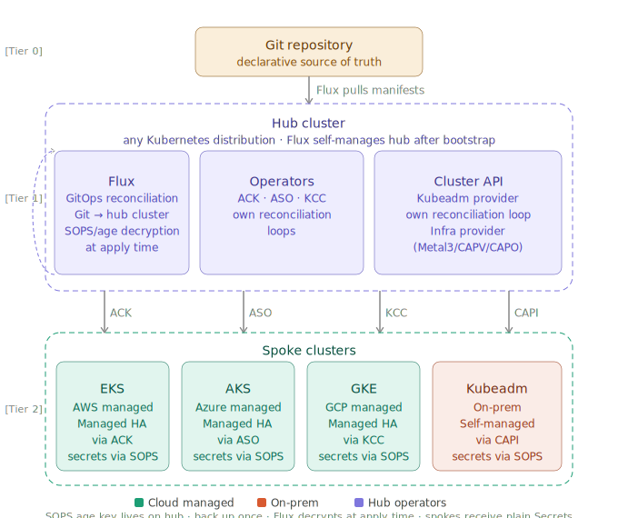

# GitOps Infrastructure Control Plane

Continuous Reconciliation Engine for Multi-Cloud Infrastructure

```text
Declarative Source of Truth
                              Git Repository              [Tier 0]
                                    |
                             Flux pulls manifests
                                    |
                                    v
+------------------------------------------------------------------------------+
|                 Hub Cluster (any Kubernetes distribution)    [Tier 1]        |
|  Flux self-manages hub after one-time manual bootstrap                       |
|------------------------------------------------------------------------------|
|  +-------------------+  +------------------+  +---------------------------+  |
|  |<--Flux            |  | Operators        |  | Cluster API (CAPI)        |  |
|  | GitOps reconcile  |  | ACK  (AWS)       |  | Kubeadm provider          |  |
|  | Git → hub cluster |  | ASO  (Azure)     |  | own reconciliation loop   |  |
|  | SOPS/age decrypt  |  | KCC  (GCP)       |  | Infra provider            |  |
|  | at apply time     |  | own recon loops  |  | (Metal3 / CAPV / CAPO)    |  |
|  +-------------------+  +------------------+  +---------------------------+  |
+------------------------------------------------------------------------------+
         |               |                |                   |
       (ACK)           (ASO)            (KCC)              (CAPI)
         |               |                |                   |
         v               v                v                   v
+-----------------------------------------------------------------------------+
|                    Spoke clusters                            [Tier 2]       |
|-----------------------------------------------------------------------------|
|  +-------------+  +-------------+  +-------------+  +-------------------+   |
|  | EKS         |  | AKS         |  | GKE         |  | Kubeadm (on-prem) |   |
|  | AWS managed |  | Azure mgd   |  | GCP managed |  | Self-managed      |   |
|  | Managed HA  |  | Managed HA  |  | Managed HA  |  | Lifecycle via     |   |
|  | via ACK     |  | via ASO     |  | via KCC     |  | CAPI + infra prov |   |
|  | secrets via |  | secrets via |  | secrets via |  | secrets via       |   |
|  | SOPS        |  | SOPS        |  | SOPS        |  | SOPS              |   |
|  +-------------+  +-------------+  +-------------+  +-------------------+   |
+-----------------------------------------------------------------------------+

Secrets strategy (SOPS):
  - Secrets encrypted in Git using age public key
  - Flux decrypts at apply time using age private key (lives on hub)
  - Spokes receive plain Kubernetes Secret objects — no controller needed in spokes
  - One age key to back up (vs one key pair per cluster with Sealed Secrets)
  - Alternative: ESO + Azure Key Vault | AWS Secrets Manager | GCP Secret Manager

Notes:
  - Hub distribution is TBD (any conformant Kubernetes cluster)
  - Flux bootstrapped manually once; thereafter self-managed via Git
  - Circular dependency: Flux manages the hub it runs on (by design)
  - Spoke 4 infra provider TBD: Metal3 (bare metal), CAPV (vSphere), CAPO (OpenStack)
  - CRITICAL: Back up the SOPS age private key — store in a key vault or secrets manager
```



## Core Advantage

Traditional IaC tools (Terraform, CDK, CloudFormation, Bicep, ARM) run once and exit - they cannot continuously maintain infrastructure state. Kubernetes operators, such as Flux, ACK, ASO, KCC, can provide 24/7 continuous reconciliation that automatically detects and repairs configuration drift.

| Approach | Traditional IaC | Continuous Reconciliation |
|----------|----------------|---------------------------|
| Operation | Run once → Exit | Monitor 24/7 → Auto-heal |
| Drift Detection | Manual `plan` runs | Automatic within minutes |

## When to Use This Solution

### Good Fit
- Multi-cloud infrastructure with complex coordination needs
- Large-scale deployments requiring autonomous optimization
- Brownfield migrations with gradual modernization requirements

### Not a Good Fit
- Simple single-app deployments
- Time-critical migrations
- Small teams with basic infrastructure needs
- Cost-sensitive projects with limited budget

> Important: This repository solves specific infrastructure problems. Complete the [Problem-Solution Fit Assessment](./docs/PROBLEM-SOLUTION-FIT.md) before implementation.

## Key Features

- Continuous Reconciliation: 24/7 drift detection and auto-repair
- Multi-Cloud Integrations: AWS, Azure, GCP with native controllers
- DAG Dependencies: Explicit dependency management with Flux
- Agent Orchestration: Optional AI-enhanced consensus agents
- Multi-Language Extensions: Go, Python, Rust, TypeScript, C#, Java

## Documentation

### Essential Reading (In Order)
1. [Problem-Solution Fit](./docs/PROBLEM-SOLUTION-FIT.md) - When and how to use this solution
2. [Architecture](./docs/ARCHITECTURE.md) - Technical architecture overview
3. [Implementation Plan](./docs/implementation_plan.md) - Step-by-step deployment guide

### Implementation Examples
- [Complete Hub-Spoke](./examples/complete-hub-spoke/) - Full deployment with all features
- [Agent Orchestration](./examples/complete-hub-spoke/agent-orchestration-demo.md) - Autonomous agent coordination
- [Variants](./variants/) - Deployment variations for different scenarios

### Advanced Topics
- [AI Integration](./docs/AI-INTEGRATION-ANALYSIS.md) - Intelligent automation patterns
- [Consensus Protocols](./docs/CONSENSUS-PROTOCOL-ANALYSIS.md) - Distributed decision-making
- [Migration Strategy](./docs/LEGACY-IAC-MIGRATION-STRATEGY.md) - Converting from traditional IaC

## Contributing

https://github.com/lloydchang/gitops-infra-control-plane/pulls

## License

This repository uses dual licensing:
- AGPL-3.0: Core infrastructure manifests, logic, documentation, and examples
  - GNU Affero General Public License v3.0 - see [LICENSE](LICENSE) file - https://www.gnu.org/licenses/agpl-3.0.html
- Apache 2.0: Sample snippets requiring user adaptations
  - Apache License, Version 2.0 - see https://www.apache.org/licenses/LICENSE-2.0
