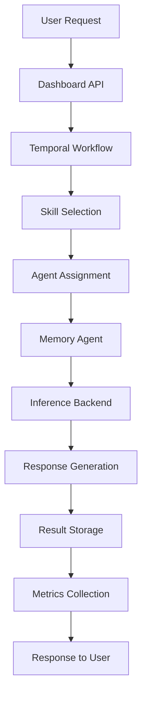
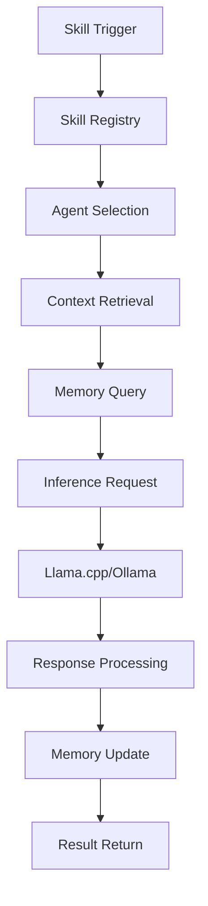
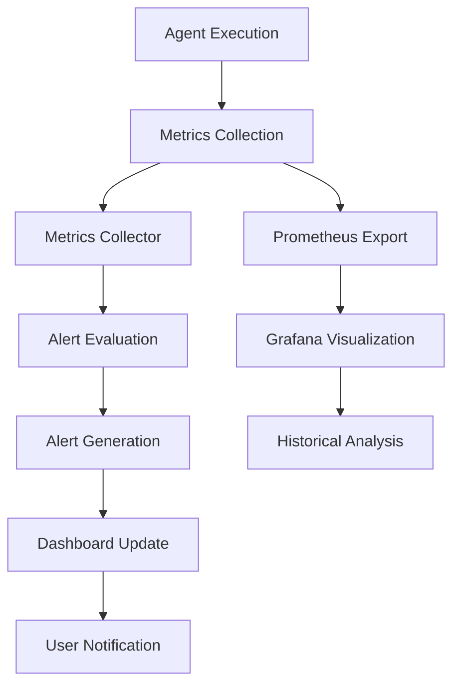

# Agents Architecture Overview

## Introduction

The Cloud Agents ecosystem is a comprehensive, distributed system designed to provide intelligent automation and orchestration capabilities for cloud infrastructure operations. This document provides a high-level architectural overview of the entire system.

## System Architecture

### 🏗️ Core Components

#### 1. Memory Agents Layer
```
┌─────────────────────────────────────────────────────────────┐
│                    Memory Agents Layer                        │
├─────────────────────────────────────────────────────────────┤
│  ┌─────────────┐  ┌─────────────┐  ┌─────────────┐         │
│  │ Rust Agent  │  │ Go Agent    │  │ Python Agent│         │
│  │             │  │             │  │             │         │
│  │ • Llama.cpp │  │ • FastAPI   │  │ • FastAPI   │         │
│  │ • SQLite    │  │ • SQLite    │  │ • SQLite    │         │
│  │ • Axum      │  │ • Gin       │  │ • Flask     │         │
│  └─────────────┘  └─────────────┘  └─────────────┘         │
└─────────────────────────────────────────────────────────────┘
```

#### 2. Orchestration Layer
```
┌─────────────────────────────────────────────────────────────┐
│                 Orchestration Layer                         │
├─────────────────────────────────────────────────────────────┤
│  ┌─────────────┐  ┌─────────────┐  ┌─────────────┐         │
│  │ Temporal     │  │ Skills      │  │ Workflow    │         │
│  │ Server      │  │ Framework   │  │ Engine      │         │
│  │             │  │             │  │             │         │
│  │ • Workflows │  │ • 64+ Skills│  │ • DAG       │         │
│  │ • Activities│  │ • Templates │  │ • Scheduling│         │
│  │ • State     │  │ • Registry  │  │ • Retries   │         │
│  └─────────────┘  └─────────────┘  └─────────────┘         │
└─────────────────────────────────────────────────────────────┘
```

#### 3. Infrastructure Layer
```
┌─────────────────────────────────────────────────────────────┐
│                Infrastructure Layer                          │
├─────────────────────────────────────────────────────────────┤
│  ┌─────────────┐  ┌─────────────┐  ┌─────────────┐         │
│  │ Kubernetes  │  │ Storage     │  │ Network     │         │
│  │ Cluster     │  │ Layer       │  │ Layer       │         │
│  │             │  │             │  │             │         │
│  │ • Pods      │  │ • PVC       │  │ • Services  │         │
│  │ • Services  │  │ • Volumes   │  │ • Ingress   │         │
│  │ • ConfigMaps│  │ • Backup    │  │ • Policies  │         │
│  └─────────────┘  └─────────────┘  └─────────────┘         │
└─────────────────────────────────────────────────────────────┘
```

#### 4. Monitoring & Observability Layer
```
┌─────────────────────────────────────────────────────────────┐
│            Monitoring & Observability Layer                  │
├─────────────────────────────────────────────────────────────┤
│  ┌─────────────┐  ┌─────────────┐  ┌─────────────┐         │
│  │ Metrics      │  │ Logging     │  │ Dashboard   │         │
│  │ Collector   │  │ System      │  │ UI          │         │
│  │             │  │             │  │             │         │
│  │ • Prometheus│  │ • ELK Stack │  │ • React     │         │
│  │ • Grafana   │  │ • Fluentd   │  │ • Charts.js │         │
│  │ • Alerts    │  │ • Kibana    │  │ • Real-time │         │
│  └─────────────┘  └─────────────┘  └─────────────┘         │
└─────────────────────────────────────────────────────────────┘
```

## Data Flow Architecture

### 🔄 Request Processing Flow

```
┌─────────────┐    ┌─────────────┐    ┌─────────────┐    ┌─────────────┐
│   User      │    │   Dashboard  │    │   API       │    │  Temporal   │
│   Request   │───▶│   Gateway   │───▶│   Gateway   │───▶│  Workflow   │
└─────────────┘    └─────────────┘    └─────────────┘    └─────────────┘
                                                           │
                                                           ▼
┌─────────────┐    ┌─────────────┐    ┌─────────────┐    ┌─────────────┐
│   Response  │◀───│   Dashboard  │◀───│   API       │◀───│  Activity   │
│   to User   │    │   Service   │    │   Service   │    │  Execution  │
└─────────────┘    └─────────────┘    └─────────────┘    └─────────────┘
                                                           │
                                                           ▼
┌─────────────┐    ┌─────────────┐    ┌─────────────┐    ┌─────────────┐
│   Metrics   │◀───│   Monitor   │◀───│   Agent     │◀───│  Memory     │
│  Collection │    │   System    │    │   Response  │    │   Agent     │
└─────────────┘    └─────────────┘    └─────────────┘    └─────────────┘
```

### 📊 Data Persistence Flow

```
┌─────────────┐    ┌─────────────┐    ┌─────────────┐    ┌─────────────┐
│   Memory    │    │   SQLite    │    │   PVC       │    │   Storage   │
│   Agent     │───▶│   Database  │───▶│   Volume    │───▶│   Backend   │
│   Data      │    │             │    │             │    │             │
└─────────────┘    └─────────────┘    └─────────────┘    └─────────────┘

┌─────────────┐    ┌─────────────┐    ┌─────────────┐    ┌─────────────┐
│  Temporal   │    │   Cassandra  │    │   PVC       │    │   Storage   │
│  State      │───▶│   Database  │───▶│   Volume    │───▶│   Backend   │
│             │    │             │    │             │    │             │
└─────────────┘    └─────────────┘    └─────────────┘    └─────────────┘
```

## Component Interactions

### 🤖 Agent Orchestration

#### Workflow Execution


#### Skill Execution


### 📈 Monitoring Flow



## Technology Stack

### 🦀 Programming Languages

#### Rust Implementation
- **Purpose**: High-performance memory agents
- **Frameworks**: Axum, Tokio, Serde
- **Database**: SQLite with rusqlite
- **Inference**: llama-cpp-2
- **Advantages**: Memory safety, performance, concurrency

#### Go Implementation
- **Purpose**: Backend services and APIs
- **Frameworks**: Gin, Temporal SDK
- **Database**: SQLite with go-sqlite3
- **Advantages**: Simplicity, ecosystem, tooling

#### Python Implementation
- **Purpose**: ML integration and rapid prototyping
- **Frameworks**: FastAPI, Flask
- **Libraries**: transformers, torch
- **Advantages**: ML ecosystem, ease of use

### 🐳 Container Technologies

#### Kubernetes Resources
```yaml
# Core Deployments
- memory-agent-rust
- memory-agent-go  
- memory-agent-python
- temporal-frontend
- temporal-worker
- skills-orchestrator
- agent-dashboard
- dashboard-api

# Services
- agent-dashboard-service
- dashboard-api-service
- memory-agent-service
- temporal-frontend

# Storage
- memory-agent-pvc
- temporal-pvc

# Networking
- ai-agents-ingress
- network-policies
```

### 📊 Monitoring Stack

#### Metrics Collection
- **Prometheus**: Metrics storage and querying
- **Grafana**: Visualization and dashboards
- **Custom Collector**: Go-based metrics collection
- **Alertmanager**: Alert routing and management

#### Logging Stack
- **Fluentd**: Log collection and forwarding
- **Elasticsearch**: Log storage and search
- **Kibana**: Log visualization and analysis

## Security Architecture

### 🔒 Security Layers

#### Network Security
```
┌─────────────────────────────────────────────────────────────┐
│                    Network Security                         │
├─────────────────────────────────────────────────────────────┤
│  ┌─────────────┐  ┌─────────────┐  ┌─────────────┐         │
│  │ Ingress     │  │ Network     │  │ Service     │         │
│  │ Controller  │  │ Policies    │  │ Mesh        │         │
│  │             │  │             │  │             │         │
│  │ • TLS       │  │ • Isolation │  │ • mTLS      │         │
│  │ • Auth      │  │ • Rules     │  │ • Policies  │         │
│  │ • Rate Lim  │  │ • Firewall  │  │ • Observ.   │         │
│  └─────────────┘  └─────────────┘  └─────────────┘         │
└─────────────────────────────────────────────────────────────┘
```

#### Application Security
```
┌─────────────────────────────────────────────────────────────┐
│                  Application Security                        │
├─────────────────────────────────────────────────────────────┤
│  ┌─────────────┐  ┌─────────────┐  ┌─────────────┐         │
│  │ RBAC        │  │ Secrets     │  │ Input       │         │
│  │ System      │  │ Management  │  │ Validation  │         │
│  │             │  │             │  │             │         │
│  │ • Roles     │  │ • Sealed    │  │ • Sanitize  │         │
│  │ • Permissions│  │ • Encryption│  │ • Validate  │         │
│  │ • Audit     │  │ • Rotation  │  │ • Rate Lim  │         │
│  └─────────────┘  └─────────────┘  └─────────────┘         │
└─────────────────────────────────────────────────────────────┘
```

## Scalability Architecture

### 📈 Horizontal Scaling

#### Agent Scaling
```yaml
# Auto-scaling configuration
apiVersion: autoscaling/v2
kind: HorizontalPodAutoscaler
metadata:
  name: memory-agent-hpa
  namespace: ai-infrastructure
spec:
  scaleTargetRef:
    apiVersion: apps/v1
    kind: Deployment
    name: memory-agent-rust
  minReplicas: 2
  maxReplicas: 10
  metrics:
  - type: Resource
    resource:
      name: cpu
      target:
        type: Utilization
        averageUtilization: 70
  - type: Resource
    resource:
      name: memory
      target:
        type: Utilization
        averageUtilization: 80
```

#### Database Scaling
```yaml
# Database sharding strategy
shards:
  - shard-1: memory-agents-1
  - shard-2: memory-agents-2
  - shard-3: memory-agents-3

replication:
  - primary: shard-1-primary
  - replicas: shard-1-replica-1, shard-1-replica-2
```

### 🔄 Load Distribution

#### Service Mesh Integration
```yaml
# Istio configuration
apiVersion: networking.istio.io/v1beta1
kind: VirtualService
metadata:
  name: memory-agent-vs
  namespace: ai-infrastructure
spec:
  http:
  - match:
    - uri:
        prefix: "/api/"
    route:
    - destination:
        host: memory-agent-service
        subset: v1
      weight: 90
    - destination:
        host: memory-agent-service
        subset: v2
      weight: 10
```

## Performance Architecture

### ⚡ Performance Optimization

#### Caching Strategy
```
┌─────────────────────────────────────────────────────────────┐
│                     Caching Layer                           │
├─────────────────────────────────────────────────────────────┤
│  ┌─────────────┐  ┌─────────────┐  ┌─────────────┐         │
│  │ Application │  │ Distributed │  │ Database    │         │
│  │ Cache       │  │ Cache       │  │ Cache       │         │
│  │             │  │             │  │             │         │
│  │ • In-Memory │  │ • Redis     │  │ • Query     │         │
│  │ • LRU       │  │ • Cluster   │  │ • Results   │         │
│  │ • TTL       │  │ • Persistent│  │ • Plans     │         │
│  └─────────────┘  └─────────────┘  └─────────────┘         │
└─────────────────────────────────────────────────────────────┘
```

#### Resource Optimization
```yaml
# Resource optimization configuration
resources:
  requests:
    cpu: "100m"
    memory: "256Mi"
  limits:
    cpu: "500m"
    memory: "512Mi"
  
optimizations:
  - connection_pooling: true
  - keep_alive: true
  - compression: gzip
  - batch_size: 100
```

## Reliability Architecture

### 🛡️ High Availability

#### Multi-Zone Deployment
```yaml
# Multi-zone configuration
zones:
  - zone-a: primary
  - zone-b: secondary
  - zone-c: tertiary

replication:
  - cross_zone: true
  - async_replication: true
  - failover: automatic
```

#### Disaster Recovery
```yaml
# Disaster recovery strategy
backup:
  - frequency: hourly
  - retention: 30_days
  - storage: multi_region
  
recovery:
  - rto: 15_minutes
  - rpo: 5_minutes
  - automation: true
```

## Integration Architecture

### 🔗 External Integrations

#### Cloud Provider APIs
```
┌─────────────────────────────────────────────────────────────┐
│                Cloud Provider APIs                         │
├─────────────────────────────────────────────────────────────┤
│  ┌─────────────┐  ┌─────────────┐  ┌─────────────┐         │
│  │ AWS         │  │ Azure       │  │ GCP         │         │
│  │ Integration │  │ Integration │  │ Integration │         │
│  │             │  │             │  │             │         │
│  │ • EC2       │  │ • VM        │  │ • Compute   │         │
│  │ • S3        │  │ • Storage   │  │ • Cloud     │         │
│  │ • Lambda    │  │ • Functions │  │ • Functions │         │
│  └─────────────┘  └─────────────┘  └─────────────┘         │
└─────────────────────────────────────────────────────────────┘
```

#### Third-party Services
```
┌─────────────────────────────────────────────────────────────┐
│                Third-party Services                         │
├─────────────────────────────────────────────────────────────┤
│  ┌─────────────┐  ┌─────────────┐  ┌─────────────┐         │
│  │ Monitoring  │  │ Logging     │  │ Alerting    │         │
│  │ Services    │  │ Services    │  │ Services    │         │
│  │             │  │             │  │             │         │
│  │ • Datadog   │  │ • Papertrail│  │ • PagerDuty │         │
│  │ • New Relic │  │ • Loggly    │  │ • Slack     │         │
│  │ • Splunk    │  │ • Sumo Logic│  │ • Teams     │         │
│  └─────────────┘  └─────────────┘  └─────────────┘         │
└─────────────────────────────────────────────────────────────┘
```

## Development Architecture

### 🛠️ Development Workflow

#### CI/CD Pipeline
```
┌─────────────┐    ┌─────────────┐    ┌─────────────┐    ┌─────────────┐
│   Code      │    │   Build     │    │   Test      │    │   Deploy    │
│   Commit    │───▶│   Stage     │───▶│   Stage     │───▶│   Stage     │
└─────────────┘    └─────────────┘    └─────────────┘    └─────────────┘
                           │                   │                   │
                           ▼                   ▼                   ▼
                   ┌─────────────┐    ┌─────────────┐    ┌─────────────┐
                   │   Docker    │    │   Unit      │    │   K8s       │
                   │   Build     │    │   Tests     │    │   Deploy    │
                   │             │    │             │    │             │
                   │ • Multi-arch│  │ • Coverage   │  │ • Helm      │
                   │ • Security  │  │ • Integration│  │ • ArgoCD    │
                   │ • Scanning   │  │ • E2E       │  │ • Monitoring│
                   └─────────────┘    └─────────────┘    └─────────────┘
```

#### Testing Strategy
```
┌─────────────────────────────────────────────────────────────┐
│                    Testing Strategy                         │
├─────────────────────────────────────────────────────────────┤
│  ┌─────────────┐  ┌─────────────┐  ┌─────────────┐         │
│  │ Unit        │  │ Integration │  │ E2E         │         │
│  │ Tests       │  │ Tests       │  │ Tests       │         │
│  │             │  │             │  │             │         │
│  │ • Functions │  │ • APIs      │  │ • Workflows │         │
│  │ • Methods   │  │ • Database  │  │ • UI        │         │
│  │ • Modules   │  │ • Services  │  │ • End-to-end│         │
│  └─────────────┘  └─────────────┘  └─────────────┘         │
└─────────────────────────────────────────────────────────────┘
```

## Future Architecture Evolution

### 🚀 Planned Enhancements

#### Multi-Cluster Architecture
```
┌─────────────────────────────────────────────────────────────┐
│                Multi-Cluster Architecture                    │
├─────────────────────────────────────────────────────────────┤
│  ┌─────────────┐  ┌─────────────┐  ┌─────────────┐         │
│  │ Cluster A   │  │ Cluster B   │  │ Cluster C   │         │
│  │ (Primary)   │  │ (Secondary) │  │ (Edge)      │         │
│  │             │  │             │  │             │         │
│  │ • Core      │  │ • Scale     │  │ • Latency   │         │
│  │ • Services  │  │ • Backup    │  │ • Local     │         │
│  │ • Storage   │  │ • DR        │  │ • Processing│         │
│  └─────────────┘  └─────────────┘  └─────────────┘         │
└─────────────────────────────────────────────────────────────┘
```

#### AI/ML Integration
```
┌─────────────────────────────────────────────────────────────┐
│                 AI/ML Integration                            │
├─────────────────────────────────────────────────────────────┤
│  ┌─────────────┐  ┌─────────────┐  ┌─────────────┐         │
│  │ Model       │  │ Training    │  │ Inference   │         │
│  │ Registry    │  │ Pipeline    │  │ Engine      │         │
│  │             │  │             │  │             │         │
│  │ • Versioning │  │ • AutoML    │  │ • Serving   │         │
│  │ • Metadata  │  │ • Hyperparam │  │ • Scaling   │         │
│  │ • Artifacts │  │ • Monitoring│  │ • Optimization│        │
│  └─────────────┘  └─────────────┘  └─────────────┘         │
└─────────────────────────────────────────────────────────────┘
```

## Conclusion

The Cloud AI Agents architecture is designed to be:

- **Modular**: Components are loosely coupled and independently deployable
- **Scalable**: Horizontal scaling support for all layers
- **Resilient**: High availability and disaster recovery capabilities
- **Observable**: Comprehensive monitoring and logging
- **Secure**: Multi-layered security approach
- **Extensible**: Plugin architecture for future enhancements

This architecture provides a solid foundation for building intelligent automation systems that can scale from small deployments to enterprise-grade installations.

---

**Last Updated**: 2026-03-16  
**Version**: 1.0.0  
**Maintainer**: Cloud AI Agents Team
