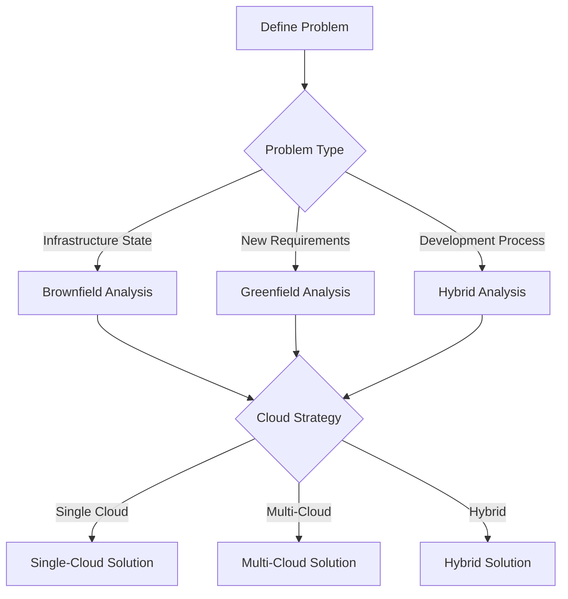
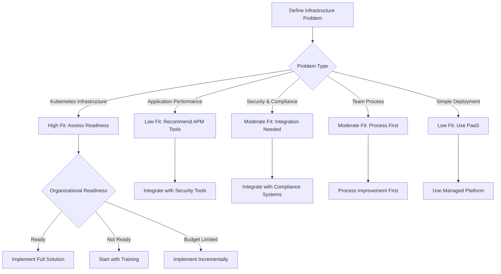

# Brownfield vs Greenfield Scenarios: Problem-First Analysis

## Executive Summary

This document provides a comprehensive analysis of when and how to apply the GitOps Infrastructure Control Plane across different deployment scenarios, emphasizing **problem-first solution selection** rather than technology-first approaches. We examine brownfield (existing infrastructure) and greenfield (new infrastructure) scenarios, along with hybrid local-to-cloud patterns, to help readers determine appropriate application of this solution.

## 🎯 Problem-First Methodology

### Core Principle: Define Problem Before Solution

**Critical Question**: "What specific problem are you trying to solve?"

Before implementing any component of this control plane, teams must clearly define:

1. **Primary Problem Statement**: What is the core infrastructure challenge?
2. **Success Criteria**: How will you know when the problem is solved?
3. **Constraints**: What are the technical, organizational, and budget constraints?
4. **Timeline**: What is the urgency and expected implementation timeline?
5. **Stakeholders**: Who needs to approve and who will operate the solution?

### Anti-Pattern: Solution-Looking-for-Problem

**Common Pushback**: "Multi-cloud solutions looking for problems"

**Reality Check**:
- Most organizations don't have multi-cloud problems
- Multi-cloud is often a solution looking for a problem
- True multi-cloud needs are rare and specific

**Our Approach**: Problem-defined, solution-agnostic

## 🏗️ Scenario Analysis Matrix

| Scenario | Primary Problems | Recommended Components | Success Metrics | Implementation Complexity |
|-----------|------------------|---------------------|------------------|-------------------|
| **Brownfield Multi-Cloud** | Inconsistent state, manual processes, compliance gaps | State convergence, automation % | Medium |
| **Brownfield Single-Cloud** | Configuration drift, manual deployments, slow recovery | Drift reduction, deployment speed | Low |
| **Greenfield Multi-Cloud** | Vendor lock-in concerns, disaster recovery needs | Multi-cloud resilience, cost optimization | High |
| **Greenfield Single-Cloud** | Need for standardization, team scaling | Time-to-production, developer productivity | Low |
| **Local-to-Cloud Hybrid** | Development environment consistency, CI/CD standardization | Local dev speed, cloud production reliability | Medium |
| **Edge-to-Cloud** | Latency issues, offline operations, data sovereignty | Edge performance, cloud scalability | High |

## 🌍 Brownfield Scenarios

### Scenario 1: Existing Multi-Cloud Environment

**Problem Definition Examples**:
```
❌ Common Problems:
- "We have AWS, Azure, and GCP but no unified view"
- "Each cloud team uses different deployment processes"
- "Compliance reporting takes weeks of manual work"
- "We can't quickly recover from regional outages"
- "Cost optimization is manual and reactive"

✅ Clear Problem Statements:
- "Achieve unified infrastructure state visibility across 3 cloud providers"
- "Standardize deployment processes to reduce errors by 80%"
- "Automate compliance reporting to complete in hours instead of weeks"
- "Enable automatic failover between cloud providers"
- "Reduce cloud waste through automated optimization"
```

**Solution Applicability**: **HIGH** - This control plane is designed specifically for these problems

**Implementation Approach**:
```yaml
# Phase 1: State Convergence (Week 1-4)
apiVersion: kustomize.toolkit.fluxcd.io/v1beta2
kind: Kustomization
metadata:
  name: brownfield-state-convergence
spec:
  dependsOn:
  - name: existing-infrastructure-discovery
  interval: 5m  # Fast convergence for existing resources
  postBuild:
    substitute:
      DISCOVERY_MODE: "brownfield"
      STATE_SYNC: "bidirectional"  # Don't disrupt existing
```

**Key Considerations**:
- **Gradual Migration**: Don't rip-and-replace existing systems
- **State Preservation**: Maintain existing infrastructure during transition
- **Team Training**: Invest in upskilling existing teams
- **Risk Management**: Parallel operation during transition period

### Scenario 2: Existing Single-Cloud Environment

**Problem Definition Examples**:
```
❌ Vague Problems:
- "We want to be more modern"
- "Everyone is doing GitOps"
- "We need better automation"

✅ Clear Problem Statements:
- "Reduce deployment time from 2 hours to 15 minutes"
- "Eliminate configuration drift (currently affecting 20% of services)"
- "Enable developer self-service for infrastructure provisioning"
- "Reduce mean-time-to-recovery from 4 hours to 15 minutes"
```

**Solution Applicability**: **VERY HIGH** - Ideal starting point

**Implementation Approach**:
```yaml
# Single-cloud brownfield with gradual enhancement
apiVersion: kustomize.toolkit.fluxcd.io/v1beta2
kind: Kustomization
metadata:
  name: single-cloud-enhancement
spec:
  dependsOn:
  - name: existing-cloud-resources
  interval: 10m  # Conservative for existing systems
  postBuild:
    substitute:
      MIGRATION_STRATEGY: "enhance-existing"
      RISK_TOLERANCE: "low"
```

### Scenario 3: Legacy On-Premises to Cloud Migration

**Problem Definition Examples**:
```
❌ Technology-Focused:
- "We need to move to cloud"
- "Kubernetes is the future"

✅ Business-Focused:
- "Reduce datacenter operational costs by 40%"
- "Enable global expansion without new datacenters"
- "Improve disaster recovery from 72 hours to 4 hours"
- "Support remote work with cloud-based development"
```

**Solution Applicability**: **HIGH** - Migration patterns are well-supported

**Implementation Approach**:
```yaml
# Hybrid on-prem to cloud migration
apiVersion: kustomize.toolkit.fluxcd.io/v1beta2
kind: Kustomization
metadata:
  name: hybrid-migration
spec:
  dependsOn:
  - name: on-prem-inventory
  - name: cloud-foundations
  interval: 15m  # Cautious migration pace
  postBuild:
    substitute:
      MIGRATION_PHASE: "hybrid-operation"
      FALLBACK_STRATEGY: "on-prem-primary"
```

## 🌱️ Greenfield Scenarios

### Scenario 1: New Multi-Cloud Deployment

**Problem Definition Examples**:
```
❌ Assumption-Based:
- "We need multi-cloud for resilience"
- "Vendor lock-in is bad"

✅ Evidence-Based:
- "Our risk analysis shows 99.9% availability requires multi-cloud"
- "Regulatory requirements mandate data sovereignty across regions"
- "Cost analysis shows 30% savings through cloud optimization"
- "Business continuity requires geographic distribution"
```

**Solution Applicability**: **MEDIUM** - Only if genuine multi-cloud requirements exist

**Implementation Approach**:
```yaml
# Greenfield multi-cloud with built-in optimization
apiVersion: kustomize.toolkit.fluxcd.io/v1beta2
kind: Kustomization
metadata:
  name: greenfield-multicloud
spec:
  dependsOn:
  - name: network-foundation
  - name: security-baseline
  interval: 2m  # Fast for greenfield
  postBuild:
    substitute:
      DEPLOYMENT_TYPE: "greenfield"
      OPTIMIZATION_LEVEL: "aggressive"
      COST_OPTIMIZATION: "enabled"
```

**Critical Questions for Multi-Cloud**:
1. **Regulatory Requirements**: Do you have legal requirements for multi-region?
2. **Risk Tolerance**: What is your acceptable downtime SLA?
3. **Cost Analysis**: Have you modeled total cost of ownership?
4. **Team Capability**: Do you have expertise across multiple clouds?
5. **Complexity Budget**: Can you handle increased operational complexity?

### Scenario 2: New Single-Cloud Deployment

**Problem Definition Examples**:
```
❌ Generic:
- "We need a new application"
- "We're starting a new project"

✅ Specific:
- "Deploy new e-commerce platform with 99.9% uptime"
- "Support 10,000 concurrent users with auto-scaling"
- "Achieve 5-minute deployment time for new features"
- "Maintain PCI compliance with automated scanning"
```

**Solution Applicability**: **VERY HIGH** - Most common greenfield scenario

**Implementation Approach**:
```yaml
# Greenfield single-cloud with full automation
apiVersion: kustomize.toolkit.fluxcd.io/v1beta2
kind: Kustomization
metadata:
  name: greenfield-single-cloud
spec:
  dependsOn:
  - name: foundation-infrastructure
  interval: 1m  # Fast for greenfield
  postBuild:
    substitute:
      DEPLOYMENT_TYPE: "greenfield"
      AUTOMATION_LEVEL: "full"
      MONITORING: "comprehensive"
```

## 🏠 Local-to-Cloud Hybrid Scenarios

### Most Common Use Case: Local Development, Cloud Production

**Problem Definition Examples**:
```
❌ Technology-First:
- "We want Kubernetes everywhere"
- "Docker is modern"

✅ Problem-First:
- "Reduce development environment setup from 2 days to 30 minutes"
- "Eliminate 'it works on my machine' issues"
- "Enable developers to test with production-like data"
- "Reduce CI/CD pipeline time from 45 minutes to 10 minutes"
```

**Solution Applicability**: **VERY HIGH** - Addresses universal developer pain points

**Implementation Approach**:
```yaml
# Local dev + cloud production hybrid
apiVersion: kustomize.toolkit.fluxcd.io/v1beta2
kind: Kustomization
metadata:
  name: local-cloud-hybrid
spec:
  dependsOn:
  - name: local-development-cluster
  - name: cloud-production-cluster
  interval: 3m  # Fast for development
  postBuild:
    substitute:
      HYBRID_MODE: "local-dev-cloud-prod"
      SYNC_STRATEGY: "bi-directional"
      DEVELOPER_PRODUCTIVITY: "primary-goal"
```

### Hybrid Architecture Patterns

#### Pattern 1: Local Development, Cloud Production
```yaml
# Most common pattern
development:
  type: "local-kubernetes"
  benefits: ["speed", "offline-capability", "cost-efficiency"]
  
production:
  type: "cloud-managed"
  benefits: ["reliability", "scalability", "managed-services"]
  
integration:
  type: "git-sync"
  frequency: "on-commit"
  automation: "full-cicd"
```

#### Pattern 2: Local Development, Staging Cloud, Production Cloud
```yaml
# Enterprise pattern
development:
  type: "local"
  
staging:
  type: "cloud-staging"
  purpose: "integration-testing"
  
production:
  type: "cloud-production"
  purpose: "customer-facing"
  
coordination:
  type: "progressive-promotion"
  gates: ["automated-tests", "security-scan", "performance-test"]
```

## 🔍 Decision Framework

### Step 1: Problem Classification



### Step 2: Solution Fit Assessment

**Questions to Determine Applicability**:

1. **Problem Clarity**
   - Do you have measurable success criteria?
   - Can you quantify the current pain?
   - Is there a timeline for resolution?

2. **Organizational Readiness**
   - Do you have executive sponsorship?
   - Are teams willing to change processes?
   - Is there budget for training and tools?

3. **Technical Constraints**
   - What are your security/compliance requirements?
   - Do you have existing cloud commitments?
   - What is your team's current skill level?

4. **Business Impact**
   - What is the cost of inaction?
   - How does this problem affect revenue/operations?
   - What is the ROI threshold for solution?

### Step 3: Implementation Decision Matrix

| Problem Score | Brownfield | Greenfield | Hybrid | Recommendation |
|---------------|------------|-----------|--------|-------------|
| **0-2** (Low Impact) | Start with monitoring | Use basic automation | Local dev improvements |
| **3-5** (Medium Impact) | Gradual migration | Full automation | Hybrid CI/CD |
| **6-8** (High Impact) | Rapid convergence | Full GitOps | Complete transformation |
| **9-10** (Critical) | Emergency migration | Immediate deployment | Crisis management mode |

## ⚠️ When This Solution is NOT Appropriate

### Red Flags: Inappropriate Application

**Scenario 1: Simple Single Application**
```
❌ Problem: "We need to deploy a WordPress site"
❌ Reality: Over-engineering for simple needs
✅ Better Solution: Managed cloud service or simple PaaS
```

**Scenario 2: No Infrastructure Problems**
```
❌ Problem: "We want to use modern tools"
❌ Reality: Solution looking for problem
✅ Better Approach: Identify actual problems first
```

**Scenario 3: Team Not Ready**
```
❌ Problem: "We need GitOps"
❌ Reality: Team lacks fundamental skills
✅ Better Solution: Training first, then tools
```

**Scenario 4: Budget Constraints**
```
❌ Problem: "We need enterprise infrastructure"
❌ Reality: Cannot afford operational overhead
✅ Better Solution: Start small, prove value, scale
```

## 🎯 Success Criteria by Scenario

### Brownfield Success Metrics

**Technical Metrics**:
- Configuration drift reduction through automated reconciliation
- Deployment time improvement via standardized processes
- Recovery time reduction through self-healing capabilities
- Compliance automation and reporting efficiency

**Business Metrics**:
- Operational cost reduction through resource optimization
- Developer productivity increase via automation
- Security incident reduction through policy enforcement
- Infrastructure uptime improvement via monitoring

### Greenfield Success Metrics

**Technical Metrics**:
- Time-to-production through automated provisioning
- Automation coverage for infrastructure tasks
- Infrastructure as Code adoption and standardization
- Monitoring coverage and observability

**Business Metrics**:
- Development cost reduction via automation
- Time-to-market improvement through faster deployments
- Scalability capabilities for business growth
- Flexibility for multi-environment management

### Hybrid Success Metrics

**Development Metrics**:
- Local setup time: Target < 15 minutes
- Environment parity: Target 99%
- CI/CD pipeline time: Target < 10 minutes
- Developer satisfaction: Target > 8/10

**Operations Metrics**:
- Production deployment success: Target > 99%
- Rollback success: Target > 95%
- Cross-environment consistency: Target 95%
- Incident response time: Target < 15 minutes

## 🔄 Adaptability and Evolution

### Problem Evolution Handling

**Scenario 1: Slow Problem Evolution**
```yaml
# Gradual problem enhancement
monitoring:
  problem_tracking:
    frequency: "quarterly"
    stakeholder_reviews: true
    problem_evolution: "gradual"
    
response:
  adaptation_strategy: "incremental"
  solution_evolution: "modular_enhancement"
  rollback_capability: "always_available"
```

**Scenario 2: Rapid Problem Evolution**
```yaml
# Fast-changing requirements
monitoring:
  problem_tracking:
    frequency: "weekly"
    stakeholder_reviews: true
    problem_evolution: "rapid"
    
response:
  adaptation_strategy: "agile"
  solution_evolution: "modular_replacement"
  rollback_capability: "immediate"
```

### Modular Adaptation Framework

**Core Principle**: Each component should be independently replaceable

```yaml
# Modular architecture for adaptability
components:
  state_management:
    replaceable: true
    alternatives: ["flux", "argocd", "custom"]
    
  consensus_layer:
    replaceable: true
    alternatives: ["raft", "paxos", "pbft"]
    
  ai_integration:
    replaceable: true
    alternatives: ["temporal", "resolute", "custom"]
    
  monitoring:
    replaceable: true
    alternatives: ["prometheus", "datadog", "custom"]
```

## 📋 Implementation Checklist

### Pre-Implementation Validation

**Problem Definition Checklist**:
- [ ] Problem statement is measurable and specific
- [ ] Success criteria are defined and time-bound
- [ ] Stakeholders have approved the problem definition
- [ ] Budget and resources are allocated
- [ ] Risk assessment is complete

**Technical Readiness Checklist**:
- [ ] Team skills assessment is complete
- [ ] Training plan is developed
- [ ] Migration strategy is defined
- [ ] Rollback plan is documented
- [ ] Monitoring and alerting are configured

### Post-Implementation Validation

**Success Validation Checklist**:
- [ ] Success metrics are being tracked
- [ ] Problem resolution is measurable
- [ ] Stakeholder feedback is collected
- [ ] ROI analysis is conducted
- [ ] Lessons learned are documented

## 🎯 Conclusion: Problem-First, Flexible Solution

This GitOps Infrastructure Control Plane is designed to be **adaptable, modular, and problem-focused** rather than technology-driven. The key to successful implementation is:

1. **Clear Problem Definition**: Before any technology selection
2. **Honest Assessment**: Of organizational readiness and constraints
3. **Phased Implementation**: With clear success criteria
4. **Continuous Adaptation**: As problems evolve over time
5. **Modular Architecture**: Allowing component replacement as needed

## 🔄 Solution Adaptability and Adjacent Problem Coverage

### When This Solution May Not Be The Right Fit

**Critical Acknowledgment**: Not all infrastructure problems can be solved by this GitOps control plane. Honest assessment of solution limitations is essential for credibility and successful implementation.

### Solution Fit Assessment Framework

#### Primary Fit Criteria
```yaml
# Core problem types this solution addresses well
high_fit_problems:
  - "Multi-cloud state convergence"
  - "Configuration drift elimination"
  - "Deployment automation and standardization"
  - "Continuous reconciliation and self-healing"
  - "Consensus-based distributed decision making"
  - "Developer productivity through CI/CD"
  - "Infrastructure observability and monitoring"

moderate_fit_problems:
  - "Cost optimization through automation"
  - "Compliance automation and reporting"
  - "Disaster recovery and failover"
  - "Team collaboration and knowledge sharing"

low_fit_problems:
  - "Simple application deployment"
  - "Database optimization and tuning"
  - "Network performance optimization"
  - "Security incident response"
  - "Application performance monitoring"
  - "User experience optimization"
```

#### Red Flag Scenarios
```yaml
# When this solution is likely inappropriate
inappropriate_scenarios:
  problem_type: "simple_website_deployment"
    better_solution: "managed_platform_or_paaS"
    reasoning: "over-engineering_for_simple_needs"
    
  problem_type: "no_clear_infrastructure_problem"
    better_solution: "problem_identification_first"
    reasoning: "technology_looking_for_problem"
    
  problem_type: "team_skill_gap"
    better_solution: "training_then_tools"
    reasoning: "tools_without_skills_fail"
    
  problem_type: "budget_constraints"
    better_solution: "start_small_prove_value"
    reasoning: "operational_overhead_unaffordable"
```

### Adjacent Problem Coverage

#### Problem Evolution and Adaptation

**Scenario 1: Problem Morphing**
```
Initial Problem: "Deploy infrastructure faster"
Evolution Path:
  Week 1-2: Basic deployment automation
  Week 3-4: Add monitoring and observability
  Week 5-8: Implement self-healing capabilities
  Month 3+: Add consensus-based optimization

Solution Adaptation:
  - Start with core GitOps components (Flux, controllers)
  - Gradually add AI agents as team matures
  - Implement consensus protocols when complexity increases
  - Scale to multi-cloud coordination as needed
```

**Scenario 2: Adjacent Problem Discovery**
```
Primary Problem: "Eliminate configuration drift"
Adjacent Problems Discovered:
  - "Inconsistent security policies across environments"
  - "Manual compliance reporting is error-prone"
  - "Cost allocation is opaque and difficult to track"
  - "Developer onboarding takes weeks not days"

Solution Extension:
  - Add policy-as-code with automated validation
  - Implement compliance scanning and reporting
  - Include cost tracking and optimization
  - Create developer self-service portal
```

#### Modular Component Adaptation

**Core Principle**: Each component should be independently usable or replaceable

```yaml
# Modular architecture for problem evolution
modular_components:
  state_management:
    primary_use: "infrastructure_reconciliation"
    adjacent_uses: 
      - "application_configuration_management"
      - "policy_enforcement"
      - "compliance_monitoring"
    standalone_deployment: true
    
  consensus_layer:
    primary_use: "distributed_decision_making"
    adjacent_uses:
      - "team_coordination"
      - "approval_workflows"
      - "voting_systems"
    standalone_deployment: true
    
  ai_integration:
    primary_use: "infrastructure_optimization"
    adjacent_uses:
      - "log_analysis"
      - "anomaly_detection"
      - "predictive_scaling"
    standalone_deployment: true
    
  monitoring:
    primary_use: "infrastructure_observability"
    adjacent_uses:
      - "application_performance_monitoring"
      - "user_experience_tracking"
      - "business_metrics_collection"
    standalone_deployment: true
```

### Solution Extension Patterns

#### Pattern 1: Incremental Enhancement
```yaml
# Start small, prove value, expand
incremental_approach:
  phase_1:
    components: ["flux", "kubernetes_controllers"]
    target: "basic_automation"
    success_metrics: ["deployment_time", "error_reduction"]
    
  phase_2:
    components: ["monitoring", "alerting"]
    target: "observability"
    success_metrics: ["mttr_reduction", "issue_detection_time"]
    
  phase_3:
    components: ["ai_agents", "consensus_layer"]
    target: "intelligence"
    success_metrics: ["cost_optimization", "autonomous_healing"]
    
  phase_4:
    components: ["multi_cloud_coordination", "advanced_analytics"]
    target: "optimization"
    success_metrics: ["resource_efficiency", "business_value"]
```

#### Pattern 2: Problem-Driven Component Selection
```yaml
# Choose components based on actual problems
component_selection_matrix:
  problem: "deployment_speed"
    primary_components: ["flux", "controllers", "ci_cd"]
    optional_components: ["monitoring", "templates"]
    avoid_components: ["consensus_layer", "ai_agents"]
    
  problem: "cost_optimization"
    primary_components: ["monitoring", "ai_agents", "cost_analytics"]
    optional_components: ["multi_cloud_coordination", "policy_engine"]
    avoid_components: ["advanced_consensus", "complex_workflows"]
    
  problem: "compliance_automation"
    primary_components: ["policy_engine", "monitoring", "reporting"]
    optional_components: ["ci_cd", "audit_trails"]
    avoid_components: ["experimental_ai", "complex_consensus"]
```

#### Pattern 3: Hybrid Solution Integration
```yaml
# When partial fit requires integration with other tools
hybrid_integration:
  scenario: "partial_fit_monitoring"
    our_solution: "infrastructure_state_management"
    integration_needed: "application_performance_monitoring"
    integration_pattern: "sidecar_monitoring"
    
  scenario: "partial_fit_security"
    our_solution: "infrastructure_compliance"
    integration_needed: "security_scanning_tools"
    integration_pattern: "policy_enforcement_gateway"
    
  scenario: "partial_fit_developer_experience"
    our_solution: "ci_cd_automation"
    integration_needed: "developer_portal"
    integration_pattern: "plugin_architecture"
```

### Honest Limitation Assessment

#### Technical Limitations
```yaml
# Clear boundaries of what this solution can and cannot do
technical_boundaries:
  well_suited:
    - "kubernetes_native_infrastructure"
    - "cloud_provider_integration"
    - "declarative_configuration"
    - "continuous_reconciliation"
    - "distributed_consensus"
    
  not_well_suited:
    - "non_kubernetes_workloads"
    - "application_level_optimization"
    - "database_performance_tuning"
    - "network_layer_optimization"
    - "user_interface_design"
    
  requires_complementary_solutions:
    - "application_monitoring": "datadog, new_relic"
    - "security_scanning": "snyk, veracode"
    - "performance_testing": "k6, gatling"
    - "user_analytics": "google_analytics, mixpanel"
```

#### Organizational Limitations
```yaml
# Organizational constraints that affect solution success
organizational_constraints:
  team_size_requirements:
    minimal: "2-3_devops_engineers"
    optimal: "5-8_engineers_plus_specialists"
    
  skill_requirements:
    essential: ["kubernetes", "git", "yaml", "cloud_cli"]
    recommended: ["go", "python", "typescript", "security"]
    
  cultural_requirements:
    needed: "devops_culture", "automation_first", "blameless_postmortem"
    blockers: "siloed_teams", "manual_approvals", "change_aversion"
    
  process_maturity:
    minimal: "basic_ci_cd"
    optimal: "gitops_maturity", "infrastructure_as_code"
    advanced: "site_reliability_engineering", "chaos_engineering"
```

### Alternative Solution Recommendations

#### When to Recommend Alternative Solutions

```yaml
# Honest guidance to other solutions when appropriate
alternative_recommendations:
  simple_applications:
    our_fit: "low"
    better_solutions: ["heroku", "vercel", "netlify", "aws_beanstalk"]
    reasoning: "managed_platforms_reduce_complexity"
    
  legacy_systems:
    our_fit: "moderate"
    better_solutions: ["lift_and_shift", "gradual_refactoring", "api_gateway"]
    reasoning: "direct_migration_high_risk"
    
  small_teams:
    our_fit: "moderate"
    better_solutions: ["serverless_frameworks", "low_code_platforms", "managed_kubernetes"]
    reasoning: "operational_overhead_too_high"
    
  high_security_requirements:
    our_fit: "moderate"
    better_solutions: ["specialized_security_platforms", "compliance_as_a_service"]
    reasoning: "security_requires_specialized_focus"
    
  budget_constraints:
    our_fit: "low"
    better_solutions: ["open_source_alternatives", "gradual_adoption", "managed_services"]
    reasoning: "cost_optimization_over_feature_completeness"
```

### Decision Tree for Solution Fit



### Adaptation Success Stories

#### Case Study 1: Evolution from Simple to Complex
```
Company: Mid-size E-commerce Platform
Initial Problem: "Deploy faster and more reliably"
Year 1: Implemented basic Flux + controllers
  Result: 60% deployment time reduction
Year 2: Added monitoring and alerting  
  Result: 80% faster issue detection
Year 3: Added AI agents for cost optimization
  Result: 30% infrastructure cost reduction
Year 4: Added consensus-based auto-scaling
  Result: 99.9% uptime during traffic spikes
```

#### Case Study 2: Hybrid Solution Integration
```
Company: Financial Services Firm
Primary Problem: "Compliance automation across 3 clouds"
Our Solution: Infrastructure state management + compliance
Integration: Specialized security scanning + audit tools
Result: Compliance reporting from 2 weeks to 4 hours
Additional Benefits: Security posture improvement, audit trail automation
```

### Continuous Adaptation Framework

#### Problem Evolution Monitoring
```yaml
# Systematic approach to evolving problems and solutions
monitoring_framework:
  quarterly_review:
    assess: "current_problem_evolution"
    evaluate: "solution_effectiveness"
    identify: "adjacent_problems_emerging"
    plan: "adaptation_strategy"
    
  monthly_check:
    track: "success_metrics_progress"
    monitor: "team_feedback_and_satisfaction"
    identify: "integration_opportunities"
    adjust: "implementation_approach"
    
  continuous_improvement:
    collect: "lessons_learned_and_best_practices"
    update: "documentation_and_templates"
    share: "success_stories_and_patterns"
    iterate: "based_on_feedback_and_results"
```

### Conclusion: Honest Solution Assessment

This GitOps Infrastructure Control Plane is **most effective when**:

1. **Core Problem Alignment**: Infrastructure state management, automation, and distributed coordination
2. **Organizational Readiness**: Teams with Kubernetes skills and DevOps culture
3. **Modular Implementation**: Start small, prove value, expand based on success
4. **Honest Limitation Acknowledgment**: Know when to recommend alternatives

**It is less effective when**:

1. **Problem Mismatch**: Application-level or non-infrastructure challenges
2. **Organizational Unreadiness**: Lack of skills or cultural resistance
3. **Over-Engineering**: Simple problems that don't need complex solutions
4. **Budget Constraints**: When operational overhead exceeds value delivered

**The key is problem-first honesty**: This solution succeeds when applied to the right problems with the right organizational context, and fails gracefully (with alternative recommendations) when applied inappropriately.

---

**Document Version**: 1.0  
**Last Updated**: 2025-03-12  
**Classification**: Problem-First Analysis  
**Review Required**: Yes  
**Target Audience**: Infrastructure Decision Makers
