# Flux Architecture Diagrams

This document contains architectural diagrams and visual representations of Flux CD components and data flows for the GitOps Infra Control Plane.

## System Architecture Overview

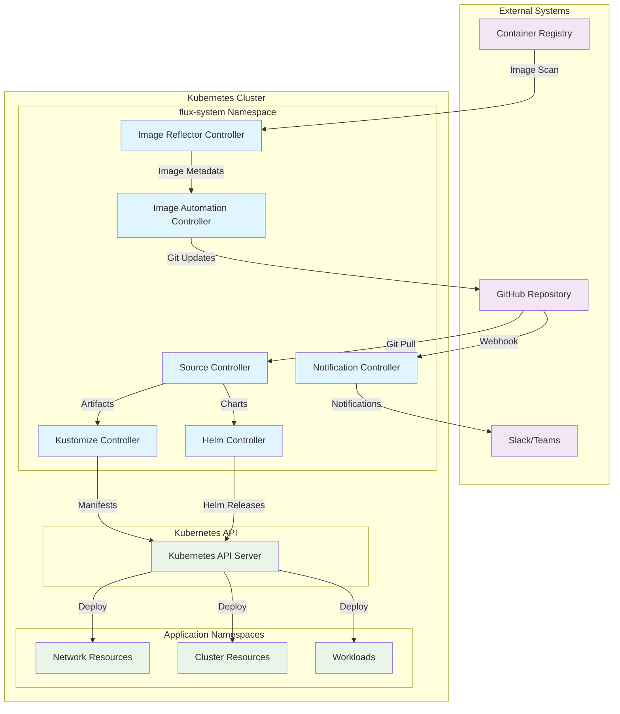

## Component Interaction Flow

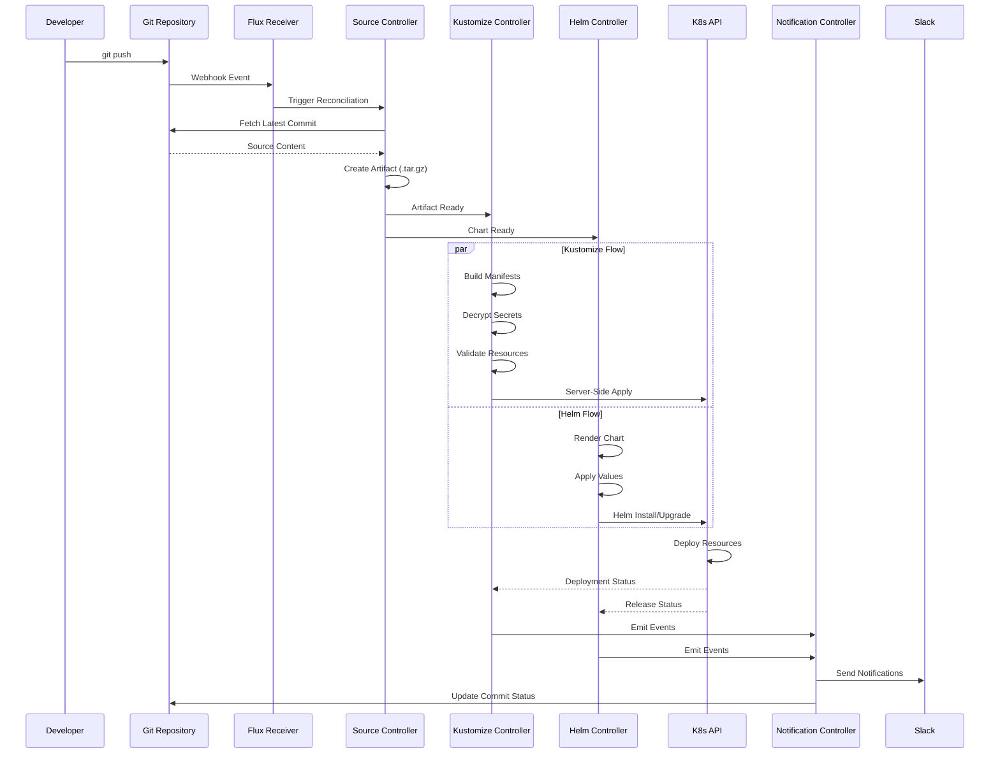

## Source Controller Architecture

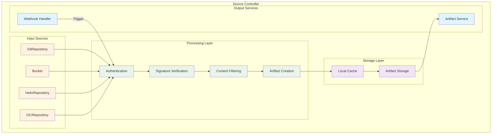

## Kustomize Controller Workflow

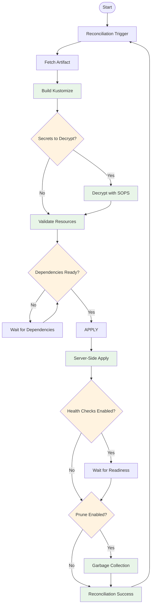

## Helm Controller Architecture

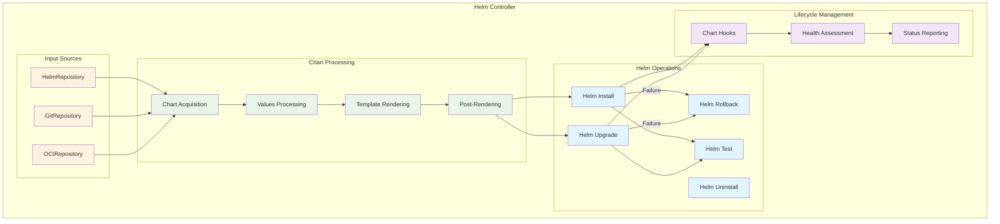

## Image Automation Flow

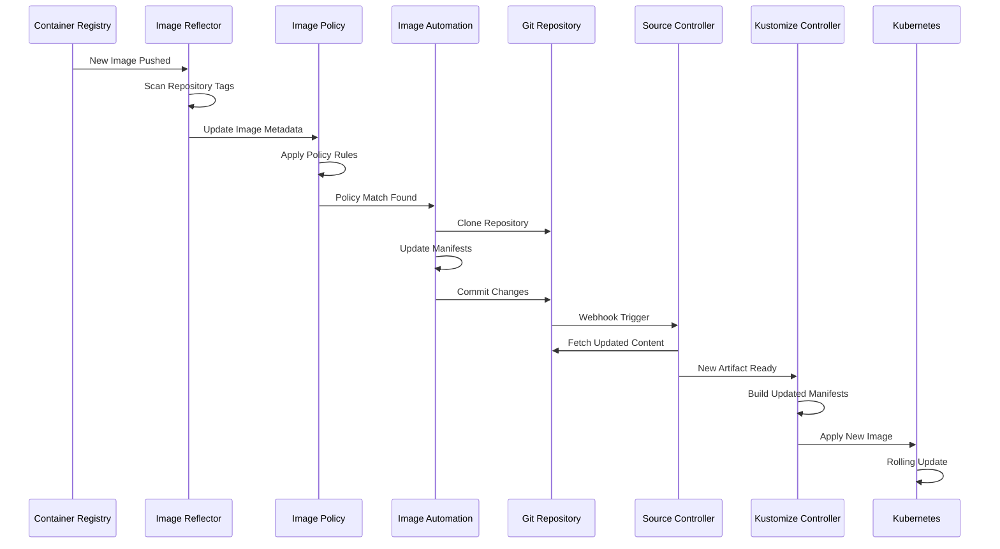

## Network Security Architecture

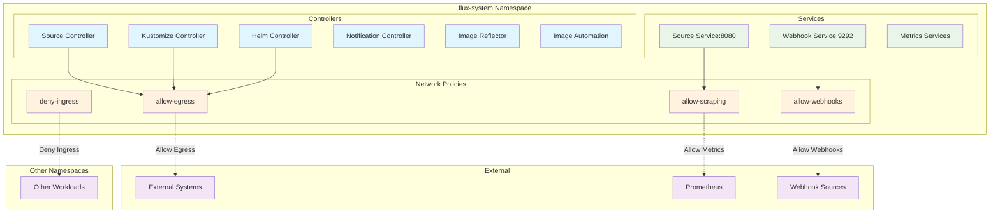

## Multi-Cluster Architecture

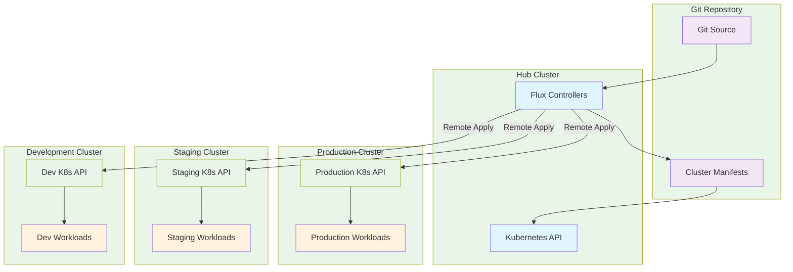

## Event Flow Architecture

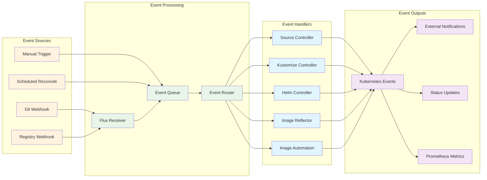

## Security and Trust Flow

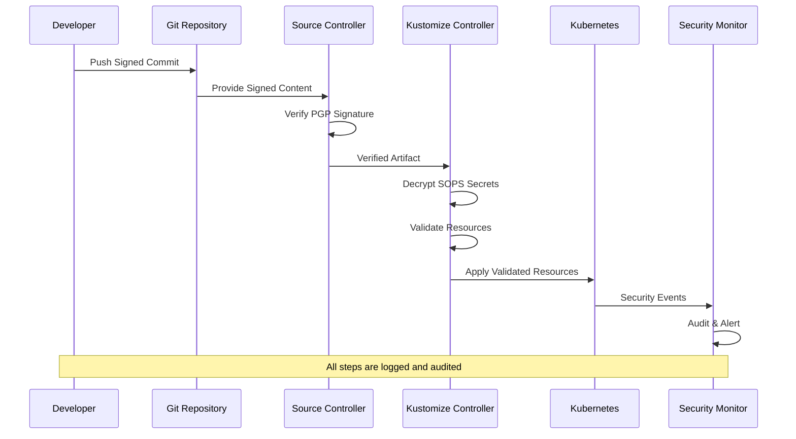

## Performance Optimization Architecture

```mermaid
graph TB
    subgraph "Optimization Layers"
        subgraph "Source Optimization"
            IGNORE[.sourceignore]
            CACHE[Artifact Cache]
            WEBHOOK[Webhook Triggers]
        end
        
        subgraph "Controller Optimization"
            PARALLEL[Parallel Reconciliation]
            DEPS[Dependency Ordering]
            BATCH[Batch Processing]
        end
        
        subgraph "Cluster Optimization"
            SSA[Server-Side Apply]
            HEALTH[Health Checks]
            PRUNE[Garbage Collection]
        end
        
        subgraph "Resource Optimization"
            LIMITS[Resource Limits]
            HPA[Horizontal Scaling]
            METRICS[Performance Metrics]
        end
    end
    
    IGNORE --> CACHE
    CACHE --> WEBHOOK
    
    WEBHOOK --> PARALLEL
    PARALLEL --> DEPS
    DEPS --> BATCH
    
    BATCH --> SSA
    SSA --> HEALTH
    HEALTH --> PRUNE
    
    PRUNE --> LIMITS
    LIMITS --> HPA
    HPA --> METRICS
    
    %% Styling
    classDef source fill:#fff3e0
    classDef controller fill:#e8f5e8
    classDef cluster fill:#e1f5fe
    classDef resource fill:#f3e5f5
    class IGNORE,CACHE,WEBHOOK source
    class PARALLEL,DEPS,BATCH controller
    class SSA,HEALTH,PRUNE cluster
    class LIMITS,HPA,METRICS resource
```

## Troubleshooting Flow Diagram

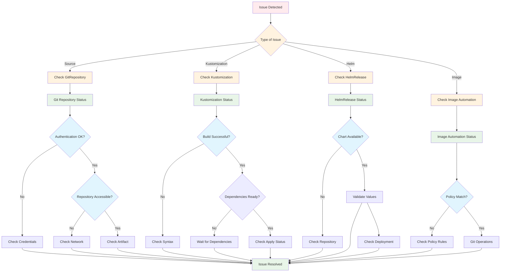

These diagrams provide comprehensive visual representations of Flux CD architecture, data flows, and operational patterns for the GitOps Infra Control Plane. They can be used for documentation, training, and troubleshooting purposes.
