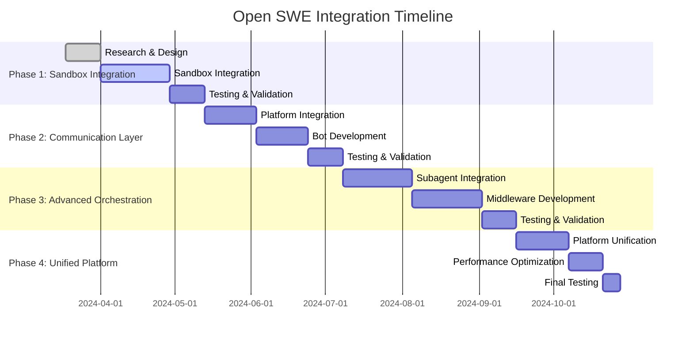

# Open SWE Integration Analysis and Plan

## Executive Summary

Open SWE (Open Source Software Engineering Agent) is LangChain's open-source framework for building internal coding agents. Based on Deep Agents and LangGraph, it provides cloud sandboxes, Slack/Linear invocation, subagent orchestration, and automatic PR creation. This document analyzes integration opportunities with our GitOps Infrastructure Control Plane and proposes a comprehensive integration strategy.

## Current State Analysis

### Open SWE Key Features
- **Agent Harness**: Built on Deep Agents framework
- **Sandbox Environments**: Isolated cloud environments (Modal, Daytona, Runloop, LangSmith)
- **Curated Tools**: Focused toolset (execute, fetch_url, http_request, commit_and_open_pr, linear_comment, slack_thread_reply)
- **Context Engineering**: AGENTS.md + source context integration
- **Orchestration**: Subagents + middleware architecture
- **Invocation**: Slack, Linear, and GitHub integration
- **Validation**: Prompt-driven + safety nets

### Our Current Architecture Strengths
- **Memory Agents**: Local inference (llama.cpp/Ollama), SQLite persistence
- **Temporal Orchestration**: Durable workflow execution with Cassandra
- **GitOps Control**: Structured JSON plans → Flux/ArgoCD reconciliation
- **Pi-Mono RPC**: Containerized agent with agentskills.io compliance
- **Skill System**: 64+ infrastructure-focused skills
- **Safety-First**: Multi-layer safety nets and human gating

## Integration Opportunities

### 1. Missing Features We Can Gain

#### Cloud Sandbox Integration
- **Current**: Local execution only
- **Open SWE**: Isolated cloud sandboxes with full shell access
- **Benefit**: Safe code execution environment for testing infrastructure changes

#### Enhanced Communication Interfaces
- **Current**: Dashboard and CLI interfaces
- **Open SWE**: Slack, Linear, and GitHub native integration
- **Benefit**: Meet engineers where they work, reduce context switching

#### Advanced Subagent Orchestration
- **Current**: Temporal workflow coordination
- **Open SWE**: Deep Agents subagent spawning with middleware
- **Benefit**: Parallel task execution with isolation and specialized contexts

#### Context Engineering
- **Current**: Memory agents with episodic/semantic/procedural memory
- **Open SWE**: AGENTS.md + rich source context injection
- **Benefit**: Better repository-aware decision making

#### Automated PR Workflow
- **Current**: Manual PR creation through GitOps
- **Open SWE**: Automatic commit and PR creation with validation
- **Benefit**: Faster iteration cycles for infrastructure changes

### 2. Features We Provide That Open SWE Lacks

#### Infrastructure Safety
- **Our Strength**: GitOps control layer with Kubernetes reconciliation
- **Open SWE Gap**: Limited infrastructure-specific safety nets
- **Integration Value**: Provide infrastructure governance to Open SWE

#### Multi-Cloud Expertise
- **Our Strength**: 64+ infrastructure skills across AWS, Azure, GCP
- **Open SWE Gap**: General-purpose coding focus
- **Integration Value**: Infrastructure domain expertise for coding tasks

#### Local Inference
- **Our Strength**: On-premise inference with llama.cpp/Ollama
- **Open SWE Gap**: Cloud-dependent model usage
- **Integration Value**: Privacy-preserving inference for sensitive infrastructure

#### Temporal Durability
- **Our Strength**: Cassandra-backed workflow persistence
- **Open SWE Gap**: LangGraph persistence (less robust for long-running workflows)
- **Integration Value**: Enterprise-grade workflow durability

## Integration Strategy

### Phase 1: Sandbox Integration (4-6 weeks)

#### Objective
Add cloud sandbox capabilities to our skill execution environment

#### Implementation Components
```yaml
# New sandbox integration layer
core/ai/runtime/sandbox/
├── providers/
│   ├── modal.yaml          # Modal cloud integration
│   ├── daytona.yaml        # Daytona sandbox provider
│   └── runloop.yaml        # Runloop integration
├── middleware/
│   ├── safety-checks.yaml  # Infrastructure-specific safety
│   └── context-inject.yaml # AGENTS.md integration
└── scripts/
    ├── sandbox-setup.sh    # Sandbox initialization
    └── sandbox-cleanup.sh  # Resource cleanup
```

#### Key Components
1. **Sandbox Provider Abstraction**: Support multiple sandbox backends
2. **Infrastructure Safety Middleware**: Extend Open SWE safety for infrastructure
3. **Context Injection**: Integrate our AGENTS.md with sandbox environments
4. **Resource Management**: Automated sandbox lifecycle management

#### Integration Points
- Extend existing skill execution to support sandbox mode
- Add sandbox configuration to skill metadata
- Integrate with Temporal for workflow coordination
- Connect to Memory agents for context persistence

### Phase 2: Communication Layer (6-8 weeks)

#### Objective
Add Slack, Linear, and GitHub native integration

#### Implementation Components
```yaml
# New communication interfaces
core/ai/runtime/communication/
├── slack/
│   ├── bot.yaml           # Slack bot configuration
│   ├── commands.yaml      # Command handling
│   └── threads.yaml       # Thread management
├── linear/
│   ├── integration.yaml   # Linear API integration
│   ├── issues.yaml        # Issue handling
│   └── comments.yaml     # Comment management
└── github/
    ├── webhooks.yaml      # GitHub webhook handling
    ├── pr-agent.yaml      # PR response agent
    └── review-flow.yaml   # Review automation
```

#### Key Components
1. **Multi-Platform Bot**: Unified agent across Slack, Linear, GitHub
2. **Thread Management**: Persistent conversation context across platforms
3. **Repository Routing**: Support `repo:owner/name` syntax for multi-repo operations
4. **Response Formatting**: Platform-appropriate response formatting

#### Integration Points
- Connect to existing Pi-Mono RPC layer
- Integrate with Memory agents for conversation history
- Link to GitOps control for infrastructure changes
- Extend skill metadata with communication preferences

### Phase 3: Advanced Orchestration (8-10 weeks)

#### Objective
Integrate Deep Agents subagent system with our Temporal workflows

#### Implementation Components
```yaml
# Enhanced orchestration
core/ai/runtime/orchestration/
├── subagents/
│   ├── spawn.yaml         # Subagent creation logic
│   ├── coordinate.yaml    # Cross-subagent coordination
│   └── merge.yaml         # Result consolidation
├── middleware/
│   ├── message-queue.yaml # Real-time message injection
│   ├── auto-pr.yaml       # Automatic PR creation
│   └── validation.yaml    # Multi-stage validation
└── deep-agents/
    ├── bridge.yaml        # Deep Agents integration
    ├── tools.yaml         # Tool compatibility layer
    └── prompts.yaml       # Prompt engineering
```

#### Key Components
1. **Subagent Bridge**: Connect Deep Agents subagents with our skills
2. **Tool Compatibility**: Map our infrastructure tools to Deep Agents toolset
3. **Middleware Pipeline**: Combine Open SWE middleware with our safety checks
4. **Prompt Engineering**: Infrastructure-aware prompt construction

#### Integration Points
- Extend Temporal workflows to support subagent spawning
- Integrate with our skill system for domain expertise
- Connect to GitOps control for safe infrastructure modifications
- Link to Memory agents for cross-subagent context sharing

### Phase 4: Unified Agent Platform (4-6 weeks)

#### Objective
Create seamless integration between all components

#### Implementation Components
```yaml
# Unified platform
core/ai/runtime/unified/
├── gateway/
│   ├── router.yaml        # Request routing logic
│   ├── load-balancer.yaml # Multi-agent load balancing
│   └── failover.yaml      # High availability
├── configuration/
│   ├── agents-md.yaml     # Enhanced AGENTS.md processing
│   ├── skills.yaml        # Skill-Deep Agents mapping
│   └── policies.yaml      # Cross-platform policies
└── monitoring/
    ├── metrics.yaml       # Unified metrics collection
    ├── tracing.yaml       # Distributed tracing
    └── alerts.yaml        # Cross-system alerting
```

## Technical Architecture

### Enhanced Agent Flow

```
User Request (Slack/Linear/GitHub/Dashboard)
         ↓
Communication Gateway (Platform Detection)
         ↓
Context Engine (AGENTS.md + Memory + Source)
         ↓
Orchestration Layer (Temporal + Deep Agents)
         ↓
┌─────────────────┬─────────────────┐
│   Local Exec    │  Sandbox Exec   │
│  (Pi-Mono RPC)  │  (Open SWE)     │
└─────────────────┴─────────────────┘
         ↓
Skill Execution (64+ skills + Deep Agents tools)
         ↓
GitOps Control (Structured plans → Flux/ArgoCD)
         ↓
Infrastructure Changes (Kubernetes reconciliation)
         ↓
Response Loop (Platform-appropriate formatting)
```

### Data Flow Integration

```yaml
# Enhanced data flow
request:
  source: slack|linear|github|dashboard|cli
  context:
    agents_md: enhanced with infrastructure rules
    memory: cross-session conversation history
    source_context: issue/pr/thread content
  routing:
    execution: local|sandbox|hybrid
    skills: infrastructure + coding tools
    safety: gitops_gates + open_swe_middleware

execution:
  orchestration: temporal_workflows + deep_agents
  subagents: parallel_task_execution
  tools: infrastructure_tools + coding_tools
  validation: multi_stage_safety_checks

response:
  format: platform_specific
  artifacts: pr_links | dashboard_links | reports
  followup: thread_persistence | notification
```

## Implementation Details

### New Skills for Open SWE Integration

#### 1. `sandbox-manager` Skill
```yaml
---
name: sandbox-manager
description: Manages cloud sandbox environments for safe code execution and testing
metadata:
  risk_level: medium
  autonomy: conditional
  layer: temporal
---
```

#### 2. `communication-bridge` Skill
```yaml
---
name: communication-bridge
description: Bridges infrastructure operations with Slack, Linear, and GitHub platforms
metadata:
  risk_level: low
  autonomy: fully_auto
  layer: temporal
---
```

#### 3. `subagent-coordinator` Skill
```yaml
---
name: subagent-coordinator
description: Coordinates multiple subagents for complex infrastructure tasks
metadata:
  risk_level: medium
  autonomy: conditional
  layer: temporal
---
```

### Enhanced AGENTS.md

```markdown
# GitOps Infrastructure Control Plane + Open SWE Integration

## Infrastructure Safety Rules
- All infrastructure changes flow through GitOps pipelines
- Use sandbox environments for code testing and validation
- Never apply changes directly to production clusters

## Communication Protocols
- Slack: Use `@gitops-agent` for infrastructure requests
- Linear: Comment `@gitops-agent` on infrastructure issues
- GitHub: Tag `@gitops-agent` in PR comments for review assistance

## Context Sources
- AGENTS.md: Repository-specific infrastructure rules
- Memory: Historical patterns and learned behaviors
- Source Context: Current issue/PR/thread content
- Skill Library: 64+ infrastructure automation skills

## Execution Modes
- Local: Pi-Mono RPC for interactive infrastructure operations
- Sandbox: Open SWE for code testing and validation
- Hybrid: Combined local + sandbox for complex workflows

## Safety Middleware
- GitOps Gates: PR validation and approval workflows
- Infrastructure Validation: Kubernetes reconciliation safety
- Resource Limits: Sandbox resource constraints
- Audit Logging: Complete operation tracking
```

### Configuration Management

```yaml
# New integration configuration
core/ai/config/
├── open-swe.yaml         # Open SWE integration settings
├── sandbox.yaml          # Sandbox provider configurations
├── communication.yaml   # Platform integration settings
└── orchestration.yaml    # Enhanced orchestration config
```

## Benefits and Outcomes

### Immediate Benefits (Phase 1-2)
1. **Safer Code Testing**: Isolated sandbox environments for infrastructure code
2. **Improved Developer Experience**: Native integration with existing tools
3. **Faster Iteration**: Automated PR creation and validation
4. **Better Context**: Rich source context integration

### Medium-term Benefits (Phase 3-4)
1. **Advanced Automation**: Subagent-based parallel task execution
2. **Unified Platform**: Seamless experience across all interfaces
3. **Enhanced Safety**: Multi-layer safety nets and validation
4. **Scalability**: Enterprise-grade workflow durability

### Strategic Benefits
1. **Market Differentiation**: Unique combination of infrastructure + coding automation
2. **Technology Leadership**: First integrated Open SWE + GitOps platform
3. **Community Positioning**: Contribution to Open SWE ecosystem
4. **Enterprise Readiness**: Production-grade integration with enterprise features

## Risk Assessment and Mitigation

### Technical Risks

#### 1. Integration Complexity
- **Risk**: Complex integration between multiple systems
- **Mitigation**: Phased rollout with extensive testing
- **Timeline**: Addressed in Phase 1 with sandbox isolation

#### 2. Performance Overhead
- **Risk**: Additional layers may impact performance
- **Mitigation**: Performance testing and optimization
- **Timeline**: Monitor throughout implementation

#### 3. Security Concerns
- **Risk**: New attack vectors with sandbox integration
- **Mitigation**: Security review and hardening
- **Timeline**: Security assessment in each phase

### Operational Risks

#### 1. Learning Curve
- **Risk**: Team needs to learn new technologies
- **Mitigation**: Documentation and training programs
- **Timeline**: Training begins in Phase 1

#### 2. Dependency Management
- **Risk**: Additional external dependencies
- **Mitigation**: Vendor management and fallback strategies
- **Timeline**: Dependency assessment in Phase 1

## Resource Requirements

### Development Team
- **Backend Developer**: Open SWE integration and sandbox management
- **DevOps Engineer**: Infrastructure and deployment automation
- **Frontend Developer**: Enhanced dashboard and communication interfaces
- **QA Engineer**: Testing and validation across all components

### Infrastructure Resources
- **Sandbox Environments**: Modal/Daytona/Runloop accounts
- **Communication Platforms**: Slack workspace, Linear workspace, GitHub org
- **Monitoring**: Enhanced observability for integrated systems
- **Storage**: Additional memory and persistence requirements

### Timeline and Milestones



## Success Metrics

### Technical Metrics
- **Integration Coverage**: Percentage of Open SWE features integrated
- **Performance**: Response time compared to current system
- **Reliability**: Uptime and error rates across integrated system
- **Safety**: Number of prevented incidents through enhanced validation

### Business Metrics
- **Developer Adoption**: Usage across different interfaces
- **Productivity**: Reduction in time for infrastructure tasks
- **Quality**: Reduction in infrastructure incidents
- **Innovation**: New capabilities enabled by integration

### User Experience Metrics
- **Satisfaction**: User feedback across all interfaces
- **Ease of Use**: Learning curve and adoption rate
- **Effectiveness**: Task completion rates and accuracy
- **Collaboration**: Cross-team and cross-platform collaboration

## Conclusion

The integration of Open SWE with our GitOps Infrastructure Control Plane represents a significant opportunity to enhance our capabilities while maintaining our core strengths in infrastructure safety and automation. By following this phased approach, we can:

1. **Maintain Safety**: Preserve our GitOps safety constraints while adding new capabilities
2. **Enhance Experience**: Provide better developer experience through native platform integration
3. **Increase Capability**: Add advanced coding agent capabilities to our infrastructure expertise
4. **Future-Proof**: Position ourselves as leaders in integrated infrastructure automation

The proposed timeline of 22-26 weeks is realistic and allows for thorough testing and validation at each phase. The resource requirements are modest and can be managed within our current team structure.

This integration will create a unique offering in the market that combines the best of both worlds: enterprise-grade infrastructure safety with advanced coding agent capabilities.
