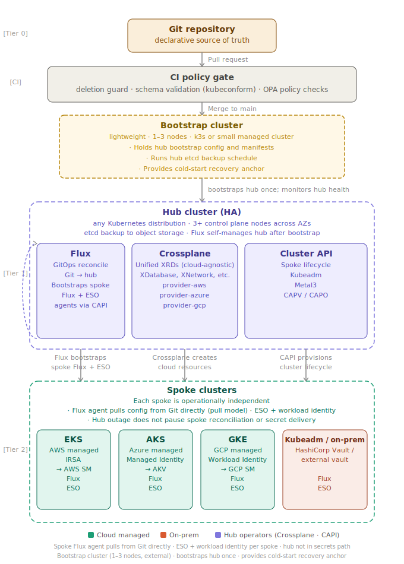

# GitOps Infra Control Plane - OVERVIEW.md

Continuous Reconciliation Engine (CRE) for Multi-Cloud Infrastructure

## Core Advantage

Traditional IaC tools (Terraform, CDK, CloudFormation, Bicep, ARM) run once and exit — they do not
continuously enforce infrastructure state. Kubernetes operators — Crossplane with provider-aws,
provider-azure, and provider-gcp — provide 24/7 continuous reconciliation that detects and repairs
configuration drift automatically. Each spoke cluster runs its own Flux agent and pulls secrets
directly from cloud vaults, so spoke operations continue independently even during hub maintenance
or failure.

| Approach | Traditional IaC | Continuous Reconciliation |
|---|---|---|
| Operation | Run once → exit | Monitor 24/7 → automatic drift correction |
| Drift detection | Manual `plan` runs | Automatic within minutes |
| Multi-cloud API | Per-provider CLI/SDK (Terraform, AWS CDK, CloudFormation, Azure Bicep, ARM, GCP Terraform Blueprints) | Unified Crossplane Composite Resource Definitions (XRDs) |
| Spoke resilience | N/A | Spokes run on last-applied state during hub outage |

> **Note on Terraform:** Terraform fits under "Per-provider CLI/SDK" because it interacts directly
> with each cloud provider via plugins, runs as a CLI tool using HCL configurations, and requires
> explicit `plan` and `apply` for state enforcement. It does not generate Crossplane XRDs or provide
> continuous reconciliation. In this architecture, Terraform is useful for initial provisioning or
> migration, but ongoing multi-cloud management relies on Crossplane and Flux for automated drift
> detection and correction.

GitOps enforces configuration drift correction by using a Git repository as the declarative source
of truth. A CI policy gate validates and guards all changes before merge. Flux reconciles the hub
and bootstraps each spoke. This enables **automatic drift reconciliation**, not full operational
self-healing — runtime failures outside Git-managed resources are handled by Kubernetes controllers
and platform automation separately.



```text
[Tier 0]      Git repository — declarative source of truth
                   |
                   |  Pull request
                   v
[CI]          CI policy gate (Conftest / OPA)
              · Schema validation (kubeconform)
              · Deletion guard: stateful XRDs require explicit approval annotation
              · Policy checks: naming, tagging, cost guardrails
                   |
                   |  Merge to main
                   v
              +-----------------------------------------------+
              | Bootstrap cluster (lightweight, 1–3 nodes)    |
              | k3s or small managed cluster                  |
              | · Holds hub bootstrap config and manifests    |
              | · Runs hub etcd backup schedule               |
              | · Provides cold-start recovery anchor         |
              +-----------------------------------------------+
                   | bootstraps hub once; monitors hub health
                   v
         +--------------------------------------------------------------------------+
[Tier 1] |                         Hub cluster (HA)                                 |
         |  Any Kubernetes distribution · 3+ control plane nodes across AZs         |
         |  etcd backup to object storage · Flux self-manages hub after bootstrap   |
         |--------------------------------------------------------------------------|
     _->-+--+------------------+  +------------------------------+  +------------+  |
    /    |  | Flux             |  | Crossplane                   |  | CAPI       |  |
   /     |  | GitOps reconcile |  | Unified XRDs (cloud-agnostic)|  | Spoke      |  |
   |     |  | Git → hub        |  | XDatabase, XNetwork, etc.    |  | lifecycle  |  |
    \    |  | Bootstraps spoke |  | provider-aws                 |  | Kubeadm    |  |
     `---+--| Flux + ESO       |  | provider-azure               |  | Metal3     |  |
         |  | agents via CAPI  |  | provider-gcp                 |  | CAPV/CAPO  |  |
         |  +------------------+  +------------------------------+  +------------+  |
         +--------------------------------------------------------------------------+
                  |                        |                          |
                  | Flux bootstraps        | Crossplane creates       | CAPI provisions
                  | spoke Flux + ESO       | cloud resources          | cluster lifecycle
                  v                        v                          v
         +--------------------------------------------------------------------------+
[Tier 2] |                          Spoke clusters                                  |
         |  Each spoke is operationally independent                                 |
         |  · Flux agent pulls config from Git directly (pull model)                |
         |  · ESO pulls secrets from cloud vault via workload identity              |
         |  · Hub outage does not pause spoke reconciliation or secret delivery     |
         |--------------------------------------------------------------------------|
         |  +----------+  +----------+  +----------+  +----------------------+      |
         |  | EKS      |  | AKS      |  | GKE      |  | Kubeadm / on-prem    |      |
         |  | IRSA     |  | Managed  |  | Workload |  | HashiCorp Vault /    |      |
         |  | → AWS SM |  | Identity |  | Identity |  | external vault       |      |
         |  |          |  | → AKV    |  | → GCP SM |  |                      |      |
         |  | Flux     |  | Flux     |  | Flux     |  | Flux                 |      |
         |  | ESO      |  | ESO      |  | ESO      |  | ESO                  |      |
         |  +----------+  +----------+  +----------+  +----------------------+      |
         +--------------------------------------------------------------------------+

Cloud-agnostic resource model (Crossplane Compositions):
  - Platform team defines XRDs once: XDatabase, XNetwork, XQueue, XCluster, etc.
  - Developers write cloud-agnostic YAML; cloud is an implementation detail
  - Crossplane Compositions translate XRDs to provider-specific managed resources
  - Switching cloud providers requires updating one Composition, not consumer manifests

Secrets strategy - External Secrets Operator (ESO) + workload identity (primary):
  - Each spoke authenticates to its cloud vault using native workload identity
    · EKS:     IRSA → AWS Secrets Manager (AWS SM)
    · AKS:     Azure Managed Identity → Azure Key Vault (AKV)
    · GKE:     Workload Identity Federation → GCP Secret Manager (GCP SM)
    · On-prem: OIDC / HashiCorp Vault
  - Hub is not in the secrets path; hub outage does not affect secret delivery
  - Spoke secret access is scoped by cloud IAM per spoke, not by network access to hub
  - Secret rotation handled by vault; no re-encrypt-and-commit cycle

Secrets strategy - Secrets OPerationS (SOPS) / age (fallback):
  - Retained for on-prem spokes and secrets with no natural cloud vault home
  - Back up the SOPS age private key to a cloud key vault
  - Flux decrypts at apply time on hub; spokes receive plain Secret objects
  - Use only where ESO + workload identity is not available

CI policy gate:
  - Deletion guard: removing a stateful XRD (XDatabase, XVolume) without an explicit
    platform.example.com/allow-deletion annotation fails CI and cannot be merged
  - Schema validation: kubeconform against current Crossplane XRD schemas
  - Policy checks: naming conventions, required tags, cost guardrail flags
  - Not a full terraform plan equivalent; does not diff current cloud state

Hub HA and recovery:
  - 3+ control plane nodes across availability zones
  - etcd backup to object storage on schedule; verify restores quarterly
  - Bootstrap cluster holds hub manifests and recovery procedure
  - Hub cold-start: provision replacement cluster → restore from bootstrap cluster config
    → Crossplane and CAPI resume; spoke clusters and secrets unaffected
  - Circular dependency: Flux manages the hub cluster it runs on (by design)
    · Bootstrap cluster provides the external recovery anchor for this case

SOPS fallback age key: back up to cloud key vault → Flux decrypts at apply time (hub-only)
                     → on-prem spokes receive plain Secret objects without requiring a controller
```

## When to Use This Solution

The premise of this architecture is to *reduce* human toil, not to create a permanent staffing
obligation. In steady state, Flux, Crossplane, and CAPI reconcile continuously with no human
involvement. The hub is a managed Kubernetes control plane — EKS, AKS, or GKE — so the cloud
provider operates the control plane nodes. Humans intervene for incidents and planned upgrades,
the same as any other managed service.

The real cost is front-loaded: getting the hub stood up, authoring the initial Crossplane
Compositions, configuring CAPI providers, and wiring per-spoke ESO workload identity takes
focused engineering time. The right question is whether that upfront investment pays off against
the problem you are solving.

### Good Fit
- Multi-cloud infrastructure (2+ clouds in production) where configuration drift is already
  causing production incidents, manual remediation, or audit failures
- Environments where the hub runs on a managed Kubernetes control plane (EKS, AKS, GKE) — the
  cloud provider operates the nodes; you operate what runs on them
- Teams with existing Kubernetes operational depth who can read controller logs and CRD status
  fields when a reconcile loop stalls
- Brownfield environments consolidating from multiple IaC tools where eliminating ongoing manual
  drift remediation justifies the upfront adoption cost

### Not a Good Fit
- Single-cloud or single-region deployments — GKE Enterprise, Azure Arc, and EKS Anywhere cover
  most of this at lower adoption cost; evaluate them first
- Environments without Kubernetes operational depth — failure modes of stuck controllers are
  opaque without it, and the adoption phase will take significantly longer than estimated
- Emergency migrations without runway — this is a target state architecture, not a migration tool
- Environments where the problem being solved (drift, multi-cloud coordination) does not yet
  exist at a scale that justifies the upfront adoption investment

> Important: Complete the [Problem-Solution Fit Assessment](./docs/PROBLEM-SOLUTION-FIT.md)
> before implementation.

## Key Features

- **Continuous Reconciliation:** 24/7 drift detection and correction via Flux on hub and per spoke
- **Cloud-Agnostic Resource Model:** Crossplane XRDs abstract AWS, Azure, and GCP behind one API
- **Spoke Autonomy:** each spoke pulls from Git and cloud vaults independently of the hub
- **Cluster Lifecycle Management:** Cluster API with Kubeadm, Metal3, CAPV, and CAPO providers
- **Per-Spoke Secret Isolation:** ESO + workload identity; hub not in the secrets delivery path
- **Pre-Merge Safety Gate:** deletion guard, schema validation, and OPA policy checks in CI
- **Hub Recovery Anchor:** secondary bootstrap cluster for cold-start and etcd backup

## Documentation

### Essential Reading
1. [Problem-Solution Fit](./docs/PROBLEM-SOLUTION-FIT.md) - When and how to use this solution
2. [Architecture](./docs/ARCHITECTURE.md) - Technical architecture including Crossplane Compositions
3. [Implementation Plan](./docs/implementation_plan.md) - Step-by-step deployment guide
4. [Implementation Summary](./docs/implementation-summary.md) - Current repo implementation map
5. [Execution Checklist](./docs/EXECUTION-CHECKLIST.md) - Apply and validate sequence

### Operations
- [Hub HA and Recovery](./docs/HUB-HA-RECOVERY.md) - Hub failure modes and cold-start recovery
- [Bootstrap Cluster Setup](./docs/BOOTSTRAP-CLUSTER.md) - Secondary cluster configuration
- [Crossplane Compositions](./docs/CROSSPLANE-COMPOSITIONS.md) - Authoring guide for platform teams
- [ESO Workload Identity](./docs/ESO-WORKLOAD-IDENTITY.md) - Per-spoke secret delivery setup
- [CI Policy Gate](./docs/CI-POLICY-GATE.md) - Deletion guard, schema validation, OPA policies
- [Controller Runbooks](./docs/CONTROLLER-RUNBOOKS.md) - Per-controller failure playbooks
- [Windows Compatibility Guide](./docs/WINDOWS-COMPATIBILITY.md) - WSL/Git Bash setup; covers automatic WSL detection and Linux (Codespaces/VM) fallback
- [macOS Compatibility Guide](./docs/MAC-COMPATIBILITY.md) - Homebrew/Python/Flux install and terminal-based validation
- [Linux Compatibility Guide](./docs/LINUX-COMPATIBILITY.md) - Reference platform; package installs and validation steps
- [Shell Compatibility Guide](./docs/SHELL-COMPATIBILITY.md) - Required POSIX/batch features and how Linux/zsh/WSL/Git Bash satisfy them
- [Agent Runtime & Clients](./docs/AGENT-RUNTIME.md) - Claude Code, Codex, Windsurf, Cursor, VS Code + Copilot setup and Azure support

### Implementation Examples
- [Overlay Examples](./overlay/examples/) - Example configurations and demos
- [Basic Example](./overlay/examples/basic/) - Basic deployment configuration
- [Production Environment](./overlay/examples/production-env/) - Production deployment examples
- [Agent Orchestration Demo](./overlay/examples/agent-orchestration-demo.md) - Multi-agent orchestration demonstration

### Advanced Topics
- [AI Integration](./docs/AI-INTEGRATION-ANALYSIS.md) - Experimental automation patterns (research only)
- [Migration Strategy](./docs/LEGACY-IAC-MIGRATION-STRATEGY.md) - Converting from traditional IaC
- [Migration Wizard Architecture](./docs/MIGRATION-WIZARD-ARCHITECTURE.md) - Modular orchestrator for overlay ordering and multi-host connectors
  - [Azure DevOps Connector](./docs/MIGRATION-WIZARD-ARCHITECTURE.md#core-components) - Use with `AZURE_DEVOPS_TOKEN`, `AZURE_DEVOPS_ORG`, `AZURE_DEVOPS_PROJECT`, and the Azure CLI to push migration branches/PRs
  - [GitHub Enterprise Server Connector](./docs/MIGRATION-WIZARD-ARCHITECTURE.md#core-components) - Supplies `GITHUB_ENTERPRISE_TOKEN` + `GITHUB_ENTERPRISE_HOST`; uses `gh pr create` for PR automation
  - [GitHub Enterprise Cloud Connector](./docs/MIGRATION-WIZARD-ARCHITECTURE.md#core-components) - Use even for `github.com` (same SaaS service); set `GITHUB_ENTERPRISE_TOKEN` and run `gh pr create`
  - [GitLab Connector](./docs/MIGRATION-WIZARD-ARCHITECTURE.md#core-components) - Supplies `GITLAB_TOKEN` (plus optional `GITLAB_HOST`); hits the GitLab merge request API
  - [GitLab on Google Cloud](./docs/MIGRATION-WIZARD-ARCHITECTURE.md#core-components) - Set `GITLAB_HOST` to your Google Cloud hosted GitLab instance along with `GITLAB_TOKEN`
  - [Bitbucket Data Center Connector](./docs/MIGRATION-WIZARD-ARCHITECTURE.md#core-components) - Supplies `BITBUCKET_DC_HOST`, `BITBUCKET_DC_USER`, `BITBUCKET_DC_TOKEN`; uses the Bitbucket REST API for PRs
  - [Bitbucket Cloud Connector](./docs/MIGRATION-WIZARD-ARCHITECTURE.md#core-components) - Supplies `BITBUCKET_USER` + `BITBUCKET_TOKEN`; uses the Bitbucket Cloud PR API
  - [AWS CodeCommit Connector](./docs/MIGRATION-WIZARD-ARCHITECTURE.md#core-components) - Uses the standard HTTPS git helper; PRs must be opened via the AWS console
  - [GCP Secure Source Manager Connector](./docs/MIGRATION-WIZARD-ARCHITECTURE.md#core-components) - Uses the gcloud git credential helper; PRs opened through the Cloud Console
- [Open Console PR Helper](./core/scripts/automation/open-gh-console-pr.sh) - Prints the AWS CodeCommit or GCP Secure Source Manager console URL for manual PR creation
- [Apply Overlay Order Helper](./core/scripts/automation/apply-overlay-order.sh) - Reorders `core/operators/flux/kustomization.yaml` per `core/operators/flux/overlay-order.txt`
- [Overlay Logician](./core/scripts/automation/overlay-logician.py) - Validates that every ordered overlay exists before running the migration wizard
- [Emulator Follow-On Runner](./core/scripts/automation/run-emulator-then-cloud.sh) - Runs `core/scripts/automation/migration_wizard.py` twice: first with `--emulator=enable`, then `--emulator=disable`
- [Zero-Touch Azure Emulator Run](./core/scripts/automation/quickstart.sh) - Executes `core/scripts/automation/prerequisites.sh` then `core/scripts/automation/migration_wizard.py` with `--connector=github`, `--overlay-order=bootstrap hub emulator-azure spoke-local`, and `--emulator=azure`

## Zero-Touch Automation

- `core/scripts/automation/quickstart.sh [--connector CONNECTOR] [--emulator-action enable|disable] [--overlay-order overlay-1,overlay-2,...]` executes bootstrap checks, migration wizard, and CI gate without interactive steps. Defaults target GitHub with the Azure emulator overlay order (`./bootstrap`, `./hub`, `./emulator-azure`, `./spoke-local`) and uses `core/scripts/automation/local-ci-gate.sh` to run `conftest` + `kubeconform`.
- The script writes logs under `logs/local-core/automation/ci-cd/` and produces a JSON report (`summary-*.json`) capturing start/end times, connector, emulator action, overlay order, helper scripts, CI gate command, and log paths.
- Override defaults to exercise other connectors/emulators (e.g., `--connector=azure-devops --overlay-order ./bootstrap,./hub,./cloud-aks,./spoke-local`).
- Use `.github/workflows/run-local-automation.yml` to trigger the wrapper via GitHub Actions (runs on `ubuntu-latest`, installs `conftest`/`kubeconform`, uploads logs/summary as artifacts). Supply `connector`, `overlay_order`, and `emulator_action` inputs to target GitHub Enterprise Cloud/Server, Azure DevOps, or other hosts on demand. – [GitHub Action file](./.github/workflows/run-local-automation.yml)
- Use `azure-pipelines-zero-touch.yml` for Azure Pipelines; it installs the same policy tooling, runs the wrapper with pipeline parameters, and publishes `logs/local-core/automation/ci-cd/` as an artifact. – [Azure Pipelines template](./azure-pipelines-zero-touch.yml)
- Both pipelines call `core/scripts/automation/publish-summary.sh` after automation completes. Set `SUMMARY_ENDPOINT` (and optional `SUMMARY_TOKEN`) to post `latest-summary.json` to a dashboard/archive service; set `NOTIFY_WEBHOOK` to receive alerts when the CI gate status equals `failure`.
- `core/scripts/automation/publish-summary.sh` also generates [logs/local-core/automation/ci-cd/latest-summary.md](logs/local-core/automation/ci-cd/latest-summary.md) — a Markdown mirror of the JSON summary listing connector, overlay order, emulator action, helper scripts, CI gate command, and log locations.

## Comparison with Managed Alternatives

Before building this architecture, evaluate whether a managed product meets your requirements:

| Product | Covers | What you still own |
|---|---|---|
| GKE Enterprise / Anthos | Multi-cluster GitOps, policy, secrets, config sync | GCP-centric; cross-cloud requires agents |
| Azure Arc | Azure + connected K8s, GitOps, policy | Azure-centric; AWS/GCP limited |
| EKS Anywhere | On-prem EKS with Flux GitOps | AWS-centric; no native Azure/GCP |
| Crossplane only | Cloud resource management, unified XRDs | No cluster lifecycle, no fleet GitOps |
| This architecture | Full multi-cloud, self-hosted, cluster + resource lifecycle | Upfront adoption cost; you own the controllers |

## Known Limitations

- No full plan equivalent: the CI gate validates and guards but does not diff current cloud state
- Crossplane Composition authoring requires upfront investment before spoke teams can use XRDs
- Multi-cluster progressive rollout requires external coordination; Flux + CAPI do not provide rollout gating equivalent to single-cluster progressive delivery
- CAPI provisions a minimal cluster; CNI, CSI, ingress, autoscaler, and monitoring must be layered on via spoke Flux separately
- On-prem spoke infra provider (Metal3, CAPV, CAPO) selection depends on hardware environment
- Flux SOPS integration has documented edge-case decryption failures; SOPS is the fallback path only in this architecture

## Documentation

### Quick Start
- [Quickstart Guide](./docs/QUICKSTART.md) - One-command deployment with AI agents and dashboard
- [Crossplane Local Development](./docs/CROSSPLANE-LOCAL-DEVELOPMENT.md) - Local development with Kind clusters
- [Local Development Setup](./docs/LOCAL-DEVELOPMENT-SETUP.md) - Development environment configuration

### AI Agents and Automation
- [AI Agents Complete Deployment Guide](./docs/AI-AGENTS-DEPLOYMENT-GUIDE.md) - Deploy AI agents ecosystem
- [AI System Debugging and Monitoring](./docs/AI-SYSTEM-DEBUGGING-MONITORING-GUIDE.md) - Debug distributed AI systems
- [AI Agents Architecture](./docs/AI-AGENTS-ARCHITECTURE.md) - AI agents system design
- [AI Agents Dashboard Guide](./docs/AGENT-DASHBOARD-GUIDE.md) - Interactive dashboard usage

### Core Infrastructure
- [Flux Architecture Diagrams](./docs/FLUX-ARCHITECTURE-DIAGRAMS.md) - Flux reconciliation patterns
- [Flux End-to-End Guide](./docs/FLUX-END-TO-END-GUIDE.md) - Complete Flux setup
- [Crossplane Compositions](./docs/CROSSPLANE-COMPOSITIONS.md) - XRDs and compositions
- [Bootstrap Cluster](./docs/BOOTSTRAP-CLUSTER.md) - Recovery anchor setup

### Advanced Topics
- [AI Integration](./docs/AI-INTEGRATION-ANALYSIS.md) - Experimental automation patterns (research only)
- [Migration Strategy](./docs/LEGACY-IAC-MIGRATION-STRATEGY.md) - Converting from traditional IaC
- [Local Development Hybrid Guide](./docs/LOCAL-DEVELOPMENT-HYBRID-GUIDE.md) - Local + cloud patterns

## Contributing

See [CONTRIBUTING.md](./CONTRIBUTING.md) for workflow guidance, Windows/WSL onboarding, and documentation expectations.

[Pull Requests](https://github.com/lloydchang/agentic-reconciliation-engine/pulls)

## License

This repository uses dual licensing:
- `AGPL-3.0`: Core manifests, logic, documentation, examples, and more — see [LICENSE](LICENSE)
- `Apache-2.0`: Specific sample snippets requiring user adaptations — see [Apache 2.0 License](https://www.apache.org/licenses/LICENSE-2.0)
