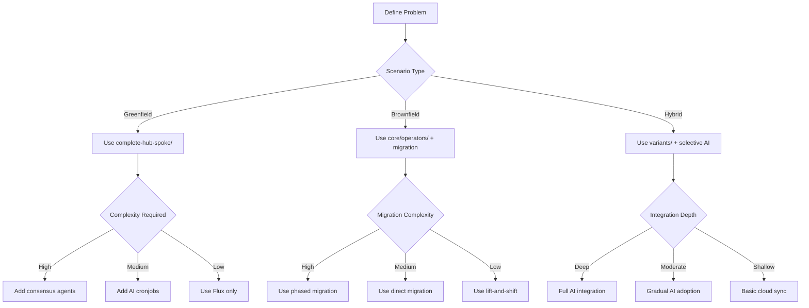

# Problem Definition Guide: Ensuring Solution-Problem Fit

## 🚨 Critical Principle: Problem-First Architecture

**This repository provides SOLUTIONS, NOT SOLUTIONS-LOOKING-FOR-PROBLEMS.** Every implementation decision MUST be driven by a clearly defined problem.

## 📋 Problem Definition Framework

### Step 1: Scenario Classification

#### 🟢 Greenfield Scenarios

**Definition**: Starting from scratch with no existing infrastructure constraints.

**Common Problems**:

- New application deployment requiring multi-cloud setup
- Startup building infrastructure from zero
- Organization entering cloud with no legacy systems
- Research projects needing flexible, experimental infrastructure

**Repository Components to Use**:

- ✅ `overlay/examples/complete-hub-spoke/` - Full multi-cloud with AI
- ✅ [docs/AI-INTEGRATION-ANALYSIS.md](docs/AI-INTEGRATION-ANALYSIS.md) - Comprehensive integration options
- ✅ [docs/AGENT-SKILLS-NEXT-LEVEL.md](docs/AGENT-SKILLS-NEXT-LEVEL.md) - Advanced orchestration patterns
- ❌ Legacy migration tools (not needed for greenfield)

**Success Indicators**:

- Time to production: < 2 weeks
- Infrastructure flexibility: High
- Team learning curve: Moderate
- Future adaptability: Maximum

#### 🟡 Brownfield Scenarios  

**Definition**: Migrating from existing infrastructure with constraints and legacy systems.

**Common Problems**:

- Migrating from Terraform/CloudFormation to GitOps
- Consolidating multi-cloud infrastructure under unified control
- Modernizing legacy deployment patterns
- Adding observability and compliance to existing systems
- Reducing costs in established environments

**Repository Components to Use**:

- ✅ `core/operators/` - Core Flux controllers first
- ✅ [docs/LEGACY-IAC-MIGRATION-STRATEGY.md](docs/LEGACY-IAC-MIGRATION-STRATEGY.md) - Migration guidance
- ✅ `core/resources/tenants/` - Phased deployment approach
- ❌ Full AI consensus (start simple, add incrementally)

**Success Indicators**:

- Migration time: 3-12 months
- Zero downtime during migration
- Cost reduction: 20-40%
- Compliance improvement: Measurable

#### 🟡 Hybrid Scenarios

**Definition**: Combining local infrastructure with cloud resources or development with production.

**Common Problems**:

- Local development teams needing cloud integration
- Edge computing with cloud coordination
- Progressive cloud migration strategies
- Multi-environment coordination (dev/staging/prod)
- Disaster recovery across on-premise and cloud

**Repository Components to Use**:

- ✅ `variants/` - Environment-specific configurations
- ✅ `overlay/examples/complete-hub-spoke/ai-cronjobs/` - Gradual AI integration
- ✅ [docs/DAG-ARCHITECTURE.md](docs/DAG-ARCHITECTURE.md) - Dependency management
- ❌ Full consensus deployment (use hybrid approach)

**Success Indicators**:

- Seamless local-cloud integration
- Gradual migration capability
- Development productivity: High
- Risk mitigation: Strong

### Step 2: Problem Specificity Matrix

| Problem Type | Repository Fit | Adaptation Strategy | Success Metrics |
|-------------|-------------------|-------------------|-------------|
| **Simple Automation** | ✅ `core/resources/tenants/3-workloads/` | Build team skills, add AI gradually | 90% automation in 6 months |
| **Multi-Cloud Coordination** | ✅ `overlay/examples/complete-hub-spoke/agent-workflows/` | Add consensus protocols | Cross-cloud consistency in 3 months |
| **Cost Optimization** | ⚠️ `overlay/examples/complete-hub-spoke/ai-cronjobs/` | Add ML capabilities | 30% cost reduction in 6 months |
| **Compliance Management** | ✅ `overlay/examples/complete-hub-spoke/ai-validation/` | Add policy engines | 100% compliance coverage |
| **Legacy Migration** | ✅ [docs/LEGACY-IAC-MIGRATION-STRATEGY.md](docs/LEGACY-IAC-MIGRATION-STRATEGY.md) | Phased migration approach | Zero downtime migration |
| **Local Development** | ⚠️ `variants/` + selective AI | Hybrid integration strategy | Developer productivity + 50% cloud adoption |

### Step 3: Implementation Decision Tree



## 🔍 Problem Validation Checklist

Before implementing ANY component, validate:

### ✅ Problem Clarity

- [ ] Specific problem statement written down
- [ ] Success criteria defined
- [ ] Failure acceptance criteria established
- [ ] Timeline and budget constraints identified

### ✅ Scenario Appropriateness  

- [ ] Deployment scenario classified (greenfield/brownfield/hybrid)
- [ ] Existing constraints documented
- [ ] Team skills and capabilities assessed
- [ ] Risk tolerance evaluated

### ✅ Solution Fit

- [ ] Solution directly addresses defined problem
- [ ] No over-engineering for current needs
- [ ] Incremental implementation path identified
- [ ] Rollback strategy defined
- [ ] Success metrics are measurable

### ✅ Repository Alignment

- [ ] Selected components match scenario requirements
- [ ] Dependencies between components understood
- [ ] Integration complexity assessed
- [ ] Maintenance and operations considered
- [ ] Future evolution path planned

## 🚨 Common Anti-Patterns

### ❌ Multi-Cloud for Single-Cloud Problems

**Anti-Pattern**: Deploying full multi-cloud stack when only using one cloud provider
**Problem**: Creates unnecessary complexity and cost
**Solution**: Start with single-cloud deployment, add multi-cloud only when cross-cloud problems emerge
**Repository Path**: Use `core/resources/tenants/` with single provider first

### ❌ AI Agents for Simple Automation

**Anti-Pattern**: Deploying consensus agents for basic automation
**Problem**: Over-engineering simple problems
**Solution**: Use Flux CronJobs or basic scripts, evolve to AI when complexity warrants
**Repository Path**: Start with `ai-cronjobs/` not `agent-workflows/`

### ❌ Technology-First Decisions

**Anti-Pattern**: Choosing technology stack before understanding requirements
**Problem**: Solution may not fit actual problem
**Solution**: Problem-first approach, then minimal technology to solve it
**Repository Path**: Use `variants/` to match technology to problem

### ❌ Big-Bang Migrations

**Anti-Pattern**: Attempting to migrate everything at once
**Problem**: High risk, high failure probability
**Solution**: Phased migration with rollback capability
**Repository Path**: Follow [docs/LEGACY-IAC-MIGRATION-STRATEGY.md](docs/LEGACY-IAC-MIGRATION-STRATEGY.md)

## 📊 Implementation Examples

### Example 1: Startup Greenfield Multi-Cloud

```yaml
# Problem: New SaaS application needs multi-cloud deployment
apiVersion: v1
kind: ConfigMap
metadata:
  name: problem-definition
data:
  scenario: "greenfield"
  primary_challenge: "multi-cloud-deployment"
  scale: "small-startup"
  constraints: "budget-limited,small-team"
  success_metrics: "99.9% uptime, <5min deployment time"
  
# Solution: Use complete-hub-spoke/ with cost optimization
implementation_path:
  - overlay/examples/complete-hub-spoke/
  - focus: ai-cronjobs/cost-optimizer.yaml
  - defer: agent-workflows/ (add when team grows)
```

### Example 2: Enterprise Brownfield Migration

```yaml
# Problem: Migrate Terraform to GitOps with zero downtime
apiVersion: v1
kind: ConfigMap
metadata:
  name: problem-definition
data:
  scenario: "brownfield"
  primary_challenge: "terraform-to-gitops-migration"
  scale: "enterprise-multi-cloud"
  constraints: "zero-downtime,compliance-required"
  success_metrics: "100% resource parity, 0% downtime"
  
# Solution: Phased migration with gradual AI integration
implementation_path:
  - core/operators/ (core Flux deployment)
  - core/resources/tenants/ (phased resource migration)
  - docs/LEGACY-IAC-MIGRATION-STRATEGY.md (migration tools)
  - overlay/examples/complete-hub-spoke/ai-cronjobs/ (post-migration optimization)
  - defer: agent-workflows/ (after migration success)
```

### Example 3: Hybrid Local-Cloud AI

```yaml
# Problem: Local development team needs cloud integration
apiVersion: v1
kind: ConfigMap
metadata:
  name: problem-definition
data:
  scenario: "hybrid"
  primary_challenge: "local-cloud-integration"
  scale: "medium-team"
  constraints: "local-tools,cloud-resources"
  success_metrics: "seamless integration, developer productivity"
  
# Solution: Hybrid variants with selective AI
implementation_path:
  - variants/local-cloud/ (hybrid configuration)
  - overlay/examples/complete-hub-spoke/ai-gateway/ (cloud integration)
  - overlay/examples/complete-hub-spoke/ai-validation/ (local validation)
  - defer: agent-workflows/ (when complexity increases)
```

## 🚨 Critical Decision: When to Walk Away

**This repository provides powerful solutions, but it is NOT appropriate for every infrastructure problem.** Some problems cannot be solved or adapted with this approach. **Knowing when to walk away is as important as knowing when to proceed.**

### Problems That Cannot Be Solved With This Solution

#### ❌ **Non-Kubernetes Environments**

**Problem**: Infrastructure not running on Kubernetes
**Why Not Adaptable**: This solution requires Kubernetes as the foundation
**Alternative Solutions**:

- **Terraform/OpenTofu**: For multi-cloud IaC without Kubernetes
- **CloudFormation/CDK**: Provider-native IaC tools
- **Pulumi**: Multi-language IaC for non-Kubernetes environments
- **Crossplane**: If you can add Kubernetes for infrastructure management

#### ❌ **Non-Cloud Environments**

**Problem**: On-premises, air-gapped, or edge environments without cloud integration
**Why Not Adaptable**: Architecture assumes cloud provider APIs and multi-cloud coordination
**Alternative Solutions**:

- **Ansible**: For traditional configuration management
- **Puppet/Chef**: For legacy infrastructure automation
- **MAAS/OpenStack**: For private cloud infrastructure
- **Kubernetes-only solutions**: If you have Kubernetes but no cloud providers

#### ❌ **Single-Application Focus**

**Problem**: Building or optimizing a single application, not infrastructure management
**Why Not Adaptable**: This is infrastructure control plane, not application platform
**Alternative Solutions**:

- **Heroku/Railway**: For single application deployment
- **Vercel/Netlify**: For frontend/web applications
- **Docker Compose**: For local development stacks
- **Application-specific platforms**: Based on your tech stack

#### ❌ **No GitOps Requirements**

**Problem**: Traditional imperative infrastructure management preferences
**Why Not Adaptable**: Core philosophy is declarative GitOps
**Alternative Solutions**:

- **Manual provisioning**: For experimental/learning environments
- **GUI-based tools**: Cloud provider consoles, Terraform Cloud UI
- **Scripted automation**: Bash/Python scripts for simple automation
- **Commercial IaC platforms**: With imperative workflows

#### ❌ **Cost Optimization as Primary Goal**

**Problem**: "Save money on cloud costs" without other infrastructure challenges
**Why Not Adaptable**: AI consensus adds complexity that may not justify cost savings
**Alternative Solutions**:

- **Cloud provider cost tools**: AWS Cost Explorer, Azure Cost Management
- **FinOps platforms**: CloudHealth, Cloudability, Apptio
- **Reserved Instances**: Simple purchasing optimizations
- **Rightsizing tools**: Without full infrastructure orchestration

### Problems That Can Be Adapted But May Not Be Worth It

#### ⚠️ **Very Small Teams (< 3 engineers)**

**Problem**: Too much complexity for tiny teams
**Adaptation Possible**: Yes, but may not be worth the overhead
**Recommendation**: Consider simpler alternatives first
**Alternative Solutions**:

- **Manual GitOps**: Git + kubectl for small teams
- **GitHub Actions/Azure DevOps**: Simple CI/CD pipelines
- **Terraform modules**: Reusable infrastructure patterns

#### ⚠️ **Short-Term Projects (< 6 months)**

**Problem**: Setup time exceeds project duration
**Adaptation Possible**: Yes, but ROI may not materialize
**Recommendation**: Use simpler solutions for short-term needs
**Alternative Solutions**:

- **Direct cloud provisioning**: For temporary infrastructure
- **Managed services**: Fully managed cloud offerings
- **Container platforms**: Docker/Kubernetes without GitOps

#### ⚠️ **Highly Regulated Environments Without Kubernetes Expertise**

**Problem**: Compliance requirements + lack of Kubernetes knowledge
**Adaptation Possible**: Technically yes, but risk of non-compliance
**Recommendation**: Build internal Kubernetes expertise first
**Alternative Solutions**:

- **Traditional IaC**: Terraform with compliance modules
- **Managed services**: SOC2/HIPAA compliant platforms
- **Consulting services**: For regulated Kubernetes adoption

### Problem Classification: Alternative Solution Matrix

| Problem Type | This Solution | Alternative Approach | When to Choose Alternative |
|-------------|----------------|----------------------|---------------------------|
| **Single Cloud** | ❌ Overkill | Terraform + Provider Tools | No multi-cloud requirements |
| **No Kubernetes** | ❌ Impossible | Ansible/Puppet | Infrastructure not containerized |
| **Manual Ops Preference** | ❌ Against Philosophy | GUI Tools + Scripts | Imperative workflows preferred |
| **Cost-Only Focus** | ⚠️ May Not Pay Off | FinOps Platforms | No other infra challenges |
| **Small Team** | ⚠️ Heavy Overhead | Simple GitOps | < 5 engineers |
| **Short Project** | ⚠️ ROI Risk | Direct Provisioning | < 6 months timeline |
| **No DevOps Culture** | ⚠️ Adoption Risk | Managed Services | Team not ready for GitOps |

### When to Adapt vs When to Walk Away

#### ✅ **Adapt This Solution When:**

- You have Kubernetes infrastructure (current or planned)
- You need multi-cloud coordination
- You want GitOps principles
- You have DevOps culture and expertise
- You need long-term infrastructure evolution
- You have complex deployment requirements

#### ❌ **Walk Away When:**

- Your infrastructure is not Kubernetes-based
- You don't need multi-cloud capabilities
- You prefer imperative over declarative approaches
- Your team lacks Kubernetes/DevOps expertise
- Your project timeline is too short for adoption
- Your problems can be solved simpler elsewhere

### Adjacent Problems & Solutions

#### If You Have Kubernetes But Not Multi-Cloud

**Use**: Basic Flux + Helm, skip this repository
**Alternative**: ArgoCD, Flux without consensus agents

#### If You Have Multi-Cloud But Not Kubernetes

**Use**: Crossplane, Terraform Cloud
**Alternative**: Provider-specific multi-cloud tools

#### If You Have Complex Apps But Simple Infrastructure

**Use**: Application platforms (Heroku, Railway)
**Alternative**: Kubernetes application-focused tools

#### If You Have Simple Infrastructure But Complex Compliance

**Use**: Traditional IaC with compliance modules
**Alternative**: Managed compliance platforms

### Decision Framework: Is This Repository Right For You?

```
Start: Define Your Infrastructure Problem
        ↓
Does your infrastructure run on Kubernetes?
├── Yes → Do you need multi-cloud coordination?
│   ├── Yes → Do you have DevOps expertise?
│   │   ├── Yes → ✅ This repository may be appropriate
│   │   └── No → ⚠️ Consider building expertise first
│   └── No → Use basic Flux instead
└── No → ❌ Walk away - wrong foundation
    ↓
Use appropriate alternative solution based on your environment
```

### Accountability Reminder

**This repository is not a general-purpose infrastructure solution.** It solves specific problems in specific contexts. If your problem doesn't match the supported scenarios, **that's not a failure of this repository** - it's correct identification that a different approach is needed.

**Your responsibility**: Clearly define your problem, assess fit, and choose the right tool for the job. Sometimes the right decision is choosing a different solution entirely.

**🎯 Principle: Right Solution for Right Problem, Not Solution Looking for Problems**

This repository's power comes from its **modularity and problem-first design**. Use it wisely:

1. **Define your problem clearly** - Be specific about what you're trying to solve
2. **Assess solution fit honestly** - Acknowledge when this repository doesn't fit
3. **Adapt strategically** - Leverage partial fits and evolve toward better alignment
4. **Choose alternatives when needed** - Sometimes the right decision is choosing a different solution entirely

**Reality Check**: No single solution fits every problem perfectly. This repository solves specific infrastructure challenges in specific contexts. If your problem doesn't match supported scenarios, **that's not a failure of this repository** - it's correct identification that a different approach is needed.

**Your Responsibility**: Clearly define your problem, assess fit honestly, and choose the right tool for the job. Sometimes the wisest decision is choosing a different solution entirely., and that's OK.

#### 🔍 Misfit Indicators

- **Implementation Complexity**: Solution feels overly complex for your problem
- **Feature Mismatch**: Repository capabilities don't align with your needs
- **Team Skill Gap**: Required expertise doesn't match your team's capabilities
- **Timeline Pressure**: Implementation takes longer than your problem allows

#### ✅ What to Do When Misfit Occurs

**1. Acknowledge Early**

```yaml
# Document the misfit assessment
apiVersion: v1
kind: ConfigMap
metadata:
  name: solution-fit-assessment
data:
  original_problem: "Your defined problem"
  repository_fit: "partial"  # or "poor" or "none"
  misfit_reasons: "complexity-overhead,feature-mismatch,skill-gap"
  adaptation_needed: "true"
```

**2. Partial Implementation Strategy**

```bash
# Use only the components that fit
kubectl apply -f core/operators/  # Core components only
kubectl apply -f core/resources/tenants/1-network/  # Specific problem areas
# Skip components that don't fit
# kubectl apply -f overlay/examples/complete-hub-spoke/agent-workflows/  # Too complex for current need
```

**3. Adaptation Path**

```yaml
# Plan for evolution toward better fit
apiVersion: v1
kind: EvolutionPlan
metadata:
  name: solution-adaptation
spec:
  current_solution: "partial-fit"
  target_capabilities: 
    - "enhanced-monitoring"
    - "gradual-ai-integration"
    - "team-skill-development"
  timeline: "6-12 months"
  phases:
  - name: "current-problem-solution"
    duration: "3 months"
  - name: "capability-building"
    duration: "3-6 months"  
  - name: "full-integration"
    duration: "3-6 months"
```

### 🔄 Adaptation to Adjacent Problems

**Principle**: Solutions often solve problems adjacent to the original challenge. Leverage partial fits to evolve toward better alignment.

#### Adjacent Problem Evolution Examples

**Example 1: From Simple Automation to Coordination**

```yaml
# Original problem: Basic deployment automation
initial_solution:
  - flux-cronjobs/basic-automation.yaml
  - team_skills: "basic kubernetes"

# Evolved problem: Multi-environment coordination
evolved_solution:
  - overlay/examples/complete-hub-spoke/ai-cronjobs/
  - overlay/examples/complete-hub-spoke/agent-workflows/
  - team_skills: "coordination, consensus"
  - new_capabilities: "cross-cloud coordination"
```

**Example 2: From Single Cloud to Multi-Cloud**

```yaml
# Original problem: Single-cloud cost optimization
initial_solution:
  - core/resources/tenants/1-network/
  - core/resources/tenants/2-clusters/
  - core/resources/tenants/3-workloads/
  - focus: "aws-cost-optimization"

# Evolved problem: Multi-cloud cost comparison
evolved_solution:
  - core/resources/tenants/1-network/
  - core/resources/tenants/2-clusters/
  - core/resources/tenants/3-workloads/
  - overlay/examples/complete-hub-spoke/ai-cronjobs/cost-optimizer.yaml
  - new_capabilities: "cross-cloud cost analysis"
```

**Example 3: From Manual to AI-Assisted**

```yaml
# Original problem: Manual compliance checking
initial_solution:
  - manual-compliance-core/core/automation/ci-cd/scripts/
  - team_time: "20 hours/week"

# Evolved problem: Automated compliance with AI
evolved_solution:
  - overlay/examples/complete-hub-spoke/ai-validation/
  - overlay/examples/complete-hub-spoke/agent-workflows/security-validator.yaml
  - team_time: "2 hours/week"
  - new_capabilities: "autonomous compliance validation"
```

## 📊 Solution Fit Matrix

| Problem Type | Repository Fit | Adaptation Strategy | Success Metrics |
|-------------|-------------------|-------------------|-------------|
| **Simple Automation** | ✅ `core/resources/tenants/3-workloads/` | Build team skills, add AI gradually | 90% automation in 6 months |
| **Multi-Cloud Coordination** | ✅ `overlay/examples/complete-hub-spoke/agent-workflows/` | Add consensus protocols | Cross-cloud consistency in 3 months |
| **Cost Optimization** | ⚠️ `overlay/examples/complete-hub-spoke/ai-cronjobs/` | Add ML capabilities | 30% cost reduction in 6 months |
| **Compliance Management** | ✅ `overlay/examples/complete-hub-spoke/ai-validation/` | Add policy engines | 100% compliance coverage |
| **Legacy Migration** | ✅ [docs/LEGACY-IAC-MIGRATION-STRATEGY.md](docs/LEGACY-IAC-MIGRATION-STRATEGY.md) | Phased migration approach | Zero downtime migration |
| **Local Development** | ⚠️ `variants/` + selective AI | Hybrid integration strategy | Developer productivity + 50% cloud adoption |

## 🚨 Solution Misfit Recognition & Adaptation Strategies

### When This Repository Isn't the Right Fit

**Critical Reality**: No single solution fits every problem perfectly. This repository may not solve YOUR specific challenge, and that's OK.

#### 🔍 Misfit Indicators

- **Implementation Complexity**: Solution feels overly complex for your problem
- **Feature Mismatch**: Repository capabilities don't align with your needs
- **Team Skill Gap**: Required expertise doesn't match your team's capabilities
- **Resource Overhead**: Solution requires more infrastructure than you have
- **Timeline Pressure**: Implementation takes longer than your problem allows

#### ✅ What to Do When Misfit Occurs

**1. Acknowledge Early**

```yaml
# Document the misfit assessment
apiVersion: v1
kind: ConfigMap
metadata:
  name: solution-fit-assessment
data:
  original_problem: "Your defined problem"
  repository_fit: "partial"  # or "poor" or "none"
  misfit_reasons: "complexity-overhead,feature-mismatch,skill-gap"
  adaptation_needed: "true"
```

**2. Partial Implementation Strategy**

```bash
# Use only the components that fit
kubectl apply -f core/operators/  # Core components only
kubectl apply -f core/resources/tenants/1-network/  # Specific problem areas
# Skip components that don't fit
# kubectl apply -f overlay/examples/complete-hub-spoke/agent-workflows/  # Too complex for current need
```

**3. Adaptation Path**

```yaml
# Plan for evolution toward better fit
apiVersion: v1
kind: EvolutionPlan
metadata:
  name: solution-adaptation
spec:
  current_solution: "partial-fit"
  target_capabilities: 
    - "enhanced-monitoring"
    - "gradual-ai-integration"
    - "team-skill-development"
  timeline: "6-12 months"
  phases:
  - name: "current-problem-solution"
    duration: "3 months"
  - name: "capability-building"
    duration: "3-6 months"  
  - name: "full-integration"
    duration: "3-6 months"
```

### 🔄 Adaptation to Adjacent Problems

**Principle**: Solutions often solve problems adjacent to the original challenge. Leverage partial fits to evolve toward better alignment.

#### Adjacent Problem Evolution Examples

**Example 1: From Simple Automation to Coordination**

```yaml
# Original problem: Basic deployment automation
initial_solution:
  - flux-cronjobs/basic-automation.yaml
  - team_skills: "basic kubernetes"

# Evolved problem: Multi-environment coordination
evolved_solution:
  - overlay/examples/complete-hub-spoke/ai-cronjobs/
  - overlay/examples/complete-hub-spoke/agent-workflows/
  - team_skills: "coordination, consensus"
  - new_capabilities: "cross-cloud coordination"
```

**Example 2: From Single Cloud to Multi-Cloud**

```yaml
# Original problem: Single-cloud cost optimization
initial_solution:
  - core/resources/tenants/1-network/
  - core/resources/tenants/2-clusters/
  - core/resources/tenants/3-workloads/
  - focus: "aws-cost-optimization"

# Evolved problem: Multi-cloud cost comparison
evolved_solution:
  - core/resources/tenants/1-network/
  - core/resources/tenants/2-clusters/
  - core/resources/tenants/3-workloads/
  - overlay/examples/complete-hub-spoke/ai-cronjobs/cost-optimizer.yaml
  - new_capabilities: "cross-cloud cost analysis"
```

**Example 3: From Manual to AI-Assisted**

```yaml
# Original problem: Manual compliance checking
initial_solution:
  - manual-compliance-core/core/automation/ci-cd/scripts/
  - team_time: "20 hours/week"

# Evolved problem: Automated compliance with AI
evolved_solution:
  - overlay/examples/complete-hub-spoke/ai-validation/
  - overlay/examples/complete-hub-spoke/agent-workflows/security-validator.yaml
  - team_time: "2 hours/week"
  - new_capabilities: "autonomous compliance validation"
```

## 🔄 Alternative Solution Paths

When this repository truly doesn't fit your problem:

### 🌐 External Solutions

- **Terraform/CloudFormation**: For declarative IaC preference
- **Ansible/Puppet**: For configuration management preference  
- **Jenkins/GitLab CI**: For alternative GitOps approaches
- **Prometheus/Grafana**: For monitoring-only solutions
- **Kustomize/Helm**: For package management preference

### 🛠️ Custom Development

- **Build domain-specific tools**: When general solutions don't fit your unique problem
- **Extend existing components**: Add custom controllers for your specific needs
- **Create specialized operators**: When existing operators don't solve your problem
- **Develop custom scripts**: For unique automation requirements

### 📚 Hybrid Approaches

- **Partial repository adoption**: Use only components that fit, supplement with custom solutions
- **Gradual migration**: Evolve from current state to desired architecture
- **Multi-repository strategy**: Combine this repository with others for complete solution
- **Platform engineering**: Build internal platform on top of existing tools
