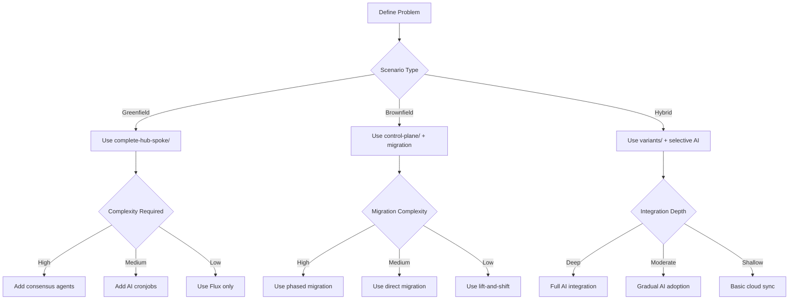

# Problem Definition Guide: Ensuring Solution-Problem Fit

## 🚨 Critical Principle: Problem-First Architecture

**This repository provides SOLUTIONS, NOT SOLUTIONS-LOOKING-FOR-PROBLEMS.** Every implementation decision MUST be driven by a clearly defined problem.

## 📋 Problem Definition Framework

### Step 1: Scenario Classification

#### 🟢 Greenfield Scenarios
**Definition**: Starting from scratch with no existing infrastructure constraints.

**Common Problems**:
- New application deployment requiring multi-cloud setup
- Startup building infrastructure from zero
- Organization entering cloud with no legacy systems
- Research projects needing flexible, experimental infrastructure

**Repository Components to Use**:
- ✅ `examples/complete-hub-spoke/` - Full multi-cloud with AI
- ✅ `docs/AI-INTEGRATION-ANALYSIS.md` - Comprehensive integration options
- ✅ `docs/AGENT-SKILLS-NEXT-LEVEL.md` - Advanced orchestration patterns
- ❌ Legacy migration tools (not needed for greenfield)

**Success Indicators**:
- Time to production: < 2 weeks
- Infrastructure flexibility: High
- Team learning curve: Moderate
- Future adaptability: Maximum

#### 🟡 Brownfield Scenarios  
**Definition**: Migrating from existing infrastructure with constraints and legacy systems.

**Common Problems**:
- Migrating from Terraform/CloudFormation to GitOps
- Consolidating multi-cloud infrastructure under unified control
- Modernizing legacy deployment patterns
- Adding observability and compliance to existing systems
- Reducing costs in established environments

**Repository Components to Use**:
- ✅ `control-plane/` - Core Flux controllers first
- ✅ `docs/LEGACY-IAC-MIGRATION-STRATEGY.md` - Migration guidance
- ✅ `infrastructure/tenants/` - Phased deployment approach
- ❌ Full AI consensus (start simple, add incrementally)

**Success Indicators**:
- Migration time: 3-12 months
- Zero downtime during migration
- Cost reduction: 20-40%
- Compliance improvement: Measurable

#### 🟡 Hybrid Scenarios
**Definition**: Combining local infrastructure with cloud resources or development with production.

**Common Problems**:
- Local development teams needing cloud integration
- Edge computing with cloud coordination
- Progressive cloud migration strategies
- Multi-environment coordination (dev/staging/prod)
- Disaster recovery across on-premise and cloud

**Repository Components to Use**:
- ✅ `variants/` - Environment-specific configurations
- ✅ `examples/complete-hub-spoke/ai-cronjobs/` - Gradual AI integration
- ✅ `docs/DAG-ARCHITECTURE.md` - Dependency management
- ❌ Full consensus deployment (use hybrid approach)

**Success Indicators**:
- Seamless local-cloud integration
- Gradual migration capability
- Development productivity: High
- Risk mitigation: Strong

### Step 2: Problem Specificity Matrix

| Problem Type | Primary Solution | Secondary Components | Success Metrics |
|-------------|-------------------|-------------------|-------------|
| **Cost Optimization** | AI agents + monitoring | 30% cost reduction |
| **Compliance Management** | Policy validation + audit | 100% compliance coverage |
| **Multi-Cloud Coordination** | Consensus agents + Flux DAG | Cross-cloud consistency |
| **Legacy Migration** | Phased migration tools | Zero downtime migration |
| **Local Development** | Hybrid variants + CI/CD | Developer productivity |
| **Disaster Recovery** | Multi-region failover | RTO < 15 minutes |
| **Security Posture** | Agent-based validation | Zero critical vulnerabilities |

### Step 3: Implementation Decision Tree



## 🔍 Problem Validation Checklist

Before implementing ANY component, validate:

### ✅ Problem Clarity
- [ ] Specific problem statement written down
- [ ] Success criteria defined
- [ ] Failure acceptance criteria established
- [ ] Timeline and budget constraints identified

### ✅ Scenario Appropriateness  
- [ ] Deployment scenario classified (greenfield/brownfield/hybrid)
- [ ] Existing constraints documented
- [ ] Team skills and capabilities assessed
- [ ] Risk tolerance evaluated

### ✅ Solution Fit
- [ ] Solution directly addresses defined problem
- [ ] No over-engineering for current needs
- [ ] Incremental implementation path identified
- [ ] Rollback strategy defined
- [ ] Success metrics are measurable

### ✅ Repository Alignment
- [ ] Selected components match scenario requirements
- [ ] Dependencies between components understood
- [ ] Integration complexity assessed
- [ ] Maintenance and operations considered
- [ ] Future evolution path planned

## 🚨 Common Anti-Patterns

### ❌ Multi-Cloud for Single-Cloud Problems
**Anti-Pattern**: Deploying full multi-cloud stack when only using one cloud provider
**Problem**: Creates unnecessary complexity and cost
**Solution**: Start with single-cloud deployment, add multi-cloud only when cross-cloud problems emerge
**Repository Path**: Use `infrastructure/tenants/` with single provider first

### ❌ AI Agents for Simple Automation
**Anti-Pattern**: Deploying consensus agents for basic automation
**Problem**: Over-engineering simple problems
**Solution**: Use Flux CronJobs or basic scripts, evolve to AI when complexity warrants
**Repository Path**: Start with `ai-cronjobs/` not `agent-workflows/`

### ❌ Technology-First Decisions
**Anti-Pattern**: Choosing technology stack before understanding requirements
**Problem**: Solution may not fit actual problem
**Solution**: Problem-first approach, then minimal technology to solve it
**Repository Path**: Use `variants/` to match technology to problem

### ❌ Big-Bang Migrations
**Anti-Pattern**: Attempting to migrate everything at once
**Problem**: High risk, high failure probability
**Solution**: Phased migration with rollback capability
**Repository Path**: Follow `docs/LEGACY-IAC-MIGRATION-STRATEGY.md`

## 📊 Implementation Examples

### Example 1: Startup Greenfield Multi-Cloud
```yaml
# Problem: New SaaS application needs multi-cloud deployment
apiVersion: v1
kind: ConfigMap
metadata:
  name: problem-definition
data:
  scenario: "greenfield"
  primary_challenge: "multi-cloud-deployment"
  scale: "small-startup"
  constraints: "budget-limited,small-team"
  success_metrics: "99.9% uptime, <5min deployment time"
  
# Solution: Use complete-hub-spoke/ with cost optimization
implementation_path:
  - examples/complete-hub-spoke/
  - focus: ai-cronjobs/cost-optimizer.yaml
  - defer: agent-workflows/ (add when team grows)
```

### Example 2: Enterprise Brownfield Migration
```yaml
# Problem: Migrate Terraform to GitOps with zero downtime
apiVersion: v1
kind: ConfigMap
metadata:
  name: problem-definition
data:
  scenario: "brownfield"
  primary_challenge: "terraform-to-gitops-migration"
  scale: "enterprise-multi-cloud"
  constraints: "zero-downtime,compliance-required"
  success_metrics: "100% resource parity, 0% downtime"
  
# Solution: Phased migration with gradual AI integration
implementation_path:
  - control-plane/ (core Flux deployment)
  - infrastructure/tenants/ (phased resource migration)
  - docs/LEGACY-IAC-MIGRATION-STRATEGY.md (migration tools)
  - examples/complete-hub-spoke/ai-cronjobs/ (post-migration optimization)
  - defer: agent-workflows/ (after migration success)
```

### Example 3: Hybrid Local-Cloud Development
```yaml
# Problem: Local development team needs cloud integration
apiVersion: v1
kind: ConfigMap
metadata:
  name: problem-definition
data:
  scenario: "hybrid"
  primary_challenge: "local-cloud-integration"
  scale: "medium-team"
  constraints: "local-tools,cloud-resources"
  success_metrics: "seamless integration, developer productivity"
  
# Solution: Hybrid variants with selective AI
implementation_path:
  - variants/local-cloud/ (hybrid configuration)
  - examples/complete-hub-spoke/ai-gateway/ (cloud integration)
  - examples/complete-hub-spoke/ai-validation/ (local validation)
  - defer: agent-workflows/ (when complexity increases)
```

## 🎯 Accountability Framework

### Reader Responsibilities
1. **Problem Definition**: You MUST define your specific problem before implementation
2. **Solution Selection**: Choose components that directly address your problem
3. **Validation**: Measure success against your defined criteria
4. **Adaptation**: Evolve solution as your problem evolves

### Repository Responsibilities
1. **Modular Components**: Provide flexible building blocks for different problems
2. **Clear Guidance**: Document when and why to use each component
3. **Anti-Pattern Documentation**: Highlight common mistakes to avoid
4. **Scenario-Specific Paths**: Provide clear implementation roadmaps

## 📚 Additional Resources

- **[STRATEGIC-ARCHITECTURE.md](./STRATEGIC-ARCHITECTURE.md)** - Overall architectural vision
- **[LEGACY-IAC-MIGRATION-STRATEGY.md](./LEGACY-IAC-MIGRATION-STRATEGY.md)** - Brownfield migration guidance
- **[AI-INTEGRATION-ANALYSIS.md](./AI-INTEGRATION-ANALYSIS.md)** - Technology selection guidance
- **[DAG-ARCHITECTURE.md](./DAG-ARCHITECTURE.md)** - Dependency management patterns

---

**🎯 Principle: Right Solution for Right Problem, Not Solution Looking for Problems**

This repository's power comes from its modularity and problem-first design. Use it wisely, define your problems clearly, and select only the components that solve YOUR specific challenges.
