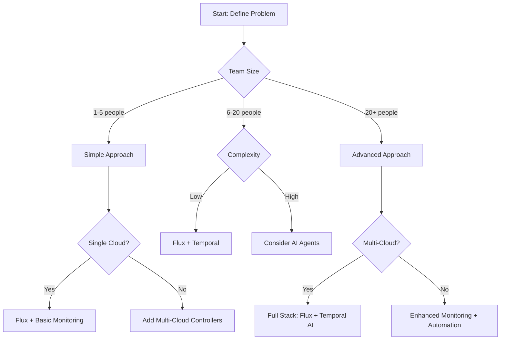
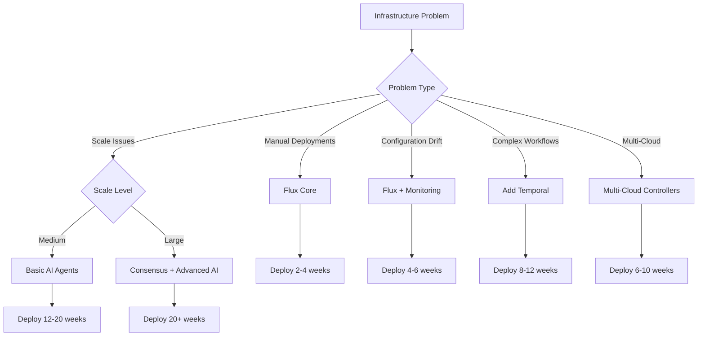

# Problem Definition Templates and Decision Matrices

## Executive Summary

This document provides **structured templates** for defining infrastructure problems and making **evidence-based decisions** about when and how to use the GitOps Infra Control Plane. It ensures **accountability** and **problem-first thinking** throughout your implementation journey.

## 🎯 Problem Definition Template

### Template 1: Basic Problem Assessment

```markdown
# Infrastructure Problem Definition

## Organization Context
- **Team Size**: [1-5 / 6-20 / 50+]
- **Infrastructure Scale**: [Small / Medium / Large / Enterprise]
- **Current Tools**: [Terraform / CloudFormation / Manual / Other: ______]
- **Cloud Providers**: [AWS / Azure / GCP / Multi-cloud]
- **Compliance Requirements**: [None / Basic / Industry-specific / Heavy]

## Primary Pain Points (Rate 1-10, 10 = most painful)
- [ ] Manual deployment processes: ___/10
- [ ] Configuration drift: ___/10
- [ ] Slow recovery from failures: ___/10
- [ ] Multi-cloud coordination: ___/10
- [ ] High operational costs: ___/10
- [ ] Lack of visibility: ___/10
- [ ] Compliance overhead: ___/10

## Current Impact
- **Deployment Frequency**: [Daily / Weekly / Monthly / Quarterly / Ad-hoc]
- **Failure Recovery Time**: [Minutes / Hours / Days]
- **Monthly Toil Hours**: [0-10 / 10-50 / 50-200 / 200+]
- **Infrastructure Cost Growth**: [0% / 1-10% / 10-25% / 25%+]

## Success Criteria
- **Target Deployment Frequency**: [Multiple times/day / Daily / Weekly]
- **Target Recovery Time**: [Seconds / Minutes / Hours]
- **Target Cost Reduction**: [0% / 10% / 25% / 50%+]
- **Target Toil Reduction**: [50% / 75% / 90%+]
```

### Template 2: Technical Constraints Analysis

```markdown
# Technical Constraints and Requirements

## Infrastructure Constraints
- **Legacy Systems**: [None / Some / Significant / Extensive]
- **Compliance Requirements**: [SOC2 / HIPAA / GDPR / PCI-DSS / Other: ______]
- **Data Sovereignty**: [None / Regional / National / Hybrid]
- **Network Restrictions**: [None / Egress-only / Air-gapped / Hybrid]
- **Change Management**: [Flexible / Moderate / Strict / Rigid]

## Team Capabilities
- **Kubernetes Experience**: [None / Basic / Proficient / Expert]
- **GitOps Experience**: [None / Basic / Proficient / Expert]
- **Cloud Native Knowledge**: [None / Basic / Proficient / Expert]
- **AI/ML Experience**: [None / Basic / Proficient / Expert]
- **DevOps Maturity**: [Manual / Basic Automation / Mature / Advanced]

## Risk Tolerance
- **Technology Adoption**: [Conservative / Moderate / Aggressive / Early Adopter]
- **Failure Impact**: [Low / Medium / High / Critical]
- **Budget Constraints**: [Tight / Moderate / Flexible / Generous]
- **Timeline Pressure**: [Relaxed / Normal / Urgent / Critical]
```

## 📊 Decision Matrices

### Matrix 1: Solution Fit Analysis

| Problem Pattern | Greenfield Fit | Brownfield Fit | Hybrid Fit | Multi-cloud Fit | Recommended Approach |
|----------------|-----------------|----------------|--------------|------------------|-------------------|
| **Manual Deployments** | ⭐⭐⭐⭐⭐ | ⭐⭐⭐⭐ | ⭐⭐⭐⭐ | ⭐⭐⭐⭐ | Basic Flux (Layer 1) |
| **Configuration Drift** | ⭐⭐⭐⭐ | ⭐⭐⭐⭐⭐ | ⭐⭐⭐⭐ | ⭐⭐⭐⭐⭐ | Flux + Monitoring (L1+L2) |
| **Multi-Cloud Coordination** | ⭐⭐ | ⭐⭐⭐ | ⭐⭐ | ⭐⭐⭐⭐⭐ | Full Stack (L1+L2+L3) |
| **Legacy Migration** | ❌ | ⭐⭐⭐⭐⭐ | ⭐⭐⭐ | ⭐⭐⭐⭐ | Migration-focused (L1+L2) |
| **Local Dev + Cloud** | ⭐⭐ | ⭐⭐ | ⭐⭐⭐⭐⭐ | ⭐⭐ | Hybrid patterns (L1+L2) |
| **Cost Optimization** | ⭐⭐⭐ | ⭐⭐⭐⭐ | ⭐⭐⭐⭐ | ⭐⭐⭐⭐⭐ | AI agents (L2+L3) |
| **Compliance Needs** | ⭐⭐⭐ | ⭐⭐⭐⭐⭐ | ⭐⭐⭐⭐ | ⭐⭐⭐⭐⭐ | Enhanced monitoring + audit |

### Matrix 2: Implementation Complexity vs. Benefit

| Component | Implementation Complexity | Team Size Required | Time to Value | Benefit Level | When to Implement |
|-----------|----------------------|-------------------|----------------|----------------|------------------|
| **Flux Core** | ⭐⭐ | 1-2 people | 2-4 weeks | ⭐⭐⭐⭐⭐ Always |
| **Basic Monitoring** | ⭐⭐ | 1-2 people | 1-2 weeks | ⭐⭐⭐⭐⭐ Always |
| **Temporal Workflows** | ⭐⭐⭐ | 2-3 people | 4-8 weeks | ⭐⭐⭐ Complex workflows |
| **Multi-Cloud Controllers** | ⭐⭐⭐ | 2-3 people | 3-6 weeks | ⭐⭐⭐ Multiple clouds |
| **AI Agents** | ⭐⭐⭐⭐ | 3-5 people | 8-12 weeks | ⭐⭐ Large scale |
| **Consensus Layer** | ⭐⭐⭐⭐⭐ | 5+ people | 12-20 weeks | ⭐ Multi-cloud enterprise |

### Matrix 3: Risk vs. Reward Analysis

| Scenario | Implementation Risk | Operational Risk | Reward Potential | Recommended Timeline |
|----------|-------------------|------------------|------------------|-------------------|
| **Greenfield Simple** | ⭐⭐ | ⭐⭐ | ⭐⭐⭐ | Start immediately |
| **Greenfield Complex** | ⭐⭐⭐ | ⭐⭐⭐ | ⭐⭐⭐⭐⭐ | Phase over 6 months |
| **Brownfield Gradual** | ⭐⭐⭐ | ⭐⭐⭐ | ⭐⭐⭐⭐ | Parallel operation 3-6 months |
| **Brownfield Big Bang** | ⭐⭐⭐⭐⭐ | ⭐⭐⭐⭐⭐ | ⭐⭐⭐ | Not recommended |
| **Hybrid Local/Cloud** | ⭐⭐ | ⭐⭐ | ⭐⭐⭐⭐ | Start with dev workflows |
| **Multi-cloud Enterprise** | ⭐⭐⭐⭐ | ⭐⭐⭐ | ⭐⭐⭐⭐⭐ | Strategic planning required |

## 🎯 Decision Flowcharts

### Flowchart 1: Initial Assessment



### Flowchart 2: Problem-Solution Mapping



## 📋 Implementation Templates

### Template 1: Small Team, Greenfield

```yaml
# Implementation Plan: Small Team (1-5 people), Greenfield
project_context:
  team_size: "1-5"
  infrastructure: "new"
  complexity: "low"
  timeline: "8-12 weeks"

phase1_foundation: # Weeks 1-4
  - flux-installation
  - basic-monitoring
  - git-repository-setup
  - deployment-pipeline
  
phase2_enhancement: # Weeks 5-8
  - alerting-setup
  - backup-strategy
  - documentation
  - team-training
  
phase3_optimization: # Weeks 9-12 (optional)
  - cost-monitoring
  - performance-tuning
  - security-scanning

success_metrics:
  - deployment_frequency: "daily"
  - recovery_time: "minutes"
  - toil_reduction: "50%"
```

### Template 2: Medium Team, Brownfield

```yaml
# Implementation Plan: Medium Team (5-20 people), Brownfield
project_context:
  team_size: "5-20"
  infrastructure: "existing"
  complexity: "medium"
  timeline: "16-24 weeks"

phase1_assessment: # Weeks 1-4
  - current-state-analysis
  - problem-identification
  - risk-assessment
  - stakeholder-alignment

phase2_parallel: # Weeks 5-12
  - flux-deployment-non-prod
  - legacy-integration-testing
  - migration-strategy
  - rollback-planning

phase3_migration: # Weeks 13-20
  - gradual-workload-migration
  - validation-testing
  - performance-monitoring
  - team-training

phase4_optimization: # Weeks 21-24 (optional)
  - ai-agents-for-optimization
  - advanced-monitoring
  - cost-optimization
  - legacy-decommissioning

success_metrics:
  - migration_success: "95%"
  - toil_reduction: "75%"
  - cost_savings: "20%"
```

### Template 3: Large Enterprise, Multi-Cloud

```yaml
# Implementation Plan: Large Team (20+ people), Multi-Cloud
project_context:
  team_size: "20+"
  infrastructure: "multi-cloud"
  complexity: "high"
  timeline: "24-36 weeks"

phase1_strategy: # Weeks 1-6
  - executive-alignment
  - multi-cloud-strategy
  - compliance-assessment
  - security-framework

phase2_foundation: # Weeks 7-14
  - flux-multi-cloud-deployment
  - temporal-workflows
  - consensus-agents
  - advanced-monitoring

phase3_intelligence: # Weeks 15-24
  - ai-optimization-agents
  - cross-cloud-coordination
  - autonomous-healing
  - predictive-scaling

phase4_optimization: # Weeks 25-36
  - advanced-ai-agents
  - cost-optimization
  - performance-tuning
  - continuous-improvement

success_metrics:
  - uptime: "99.9%"
  - deployment_frequency: "multiple-daily"
  - cost_savings: "30-50%"
  - toil_reduction: "90%"
```

## 🔍 Accountability Framework

### Success Metrics Tracking

```markdown
# Implementation Accountability Dashboard

## Primary KPIs
- **Deployment Frequency**: Target: ___ | Current: ___ | Progress: ___%
- **Lead Time**: Target: ___ | Current: ___ | Progress: ___%
- **Change Failure Rate**: Target: ___% | Current: ___% | Progress: ___%
- **MTTR**: Target: ___ | Current: ___ | Progress: ___%

## Secondary KPIs
- **Infrastructure Cost**: Target: $___ | Current: $___ | Progress: ___%
- **Team Satisfaction**: Target: ___% | Current: ___% | Progress: ___%
- **Compliance Score**: Target: ___% | Current: ___% | Progress: ___%
- **Toil Hours**: Target: ___ | Current: ___ | Progress: ___%

## Review Cadence
- **Weekly**: Team standup on metrics and blockers
- **Monthly**: Leadership review and course correction
- **Quarterly**: Strategic assessment and adaptation
- **Annually**: Architecture review and evolution planning
```

### Decision Quality Framework

| Decision | Evidence Required | Stakeholder Approval | Success Criteria | Review Timeline |
|-----------|------------------|-------------------|------------------|------------------|
| **Start Implementation** | Problem definition completed | Team lead + Tech lead | Clear ROI identified | Immediate |
| **Add Advanced Features** | Basic features working | Architecture board | Measurable improvement needed | 3 months |
| **Expand to New Cloud** | Current clouds stable | Cloud governance board | Cost/benefit analysis | 6 months |
| **Adopt New Technology** | Proof of concept successful | Innovation committee | Strategic alignment | 12 months |

## 🚨 Common Decision Traps

### Trap 1: Technology-First Thinking
**Symptom**: "We need AI agents because they're cool"
**Solution**: "What specific problem requires AI agents?"

### Trap 2: One-Size-Fits-All
**Symptom**: "Everyone must use the full stack"
**Solution**: "What does each team actually need?"

### Trap 3: Big-Bang Migration
**Symptom**: "Let's migrate everything at once"
**Solution**: "What's the minimum viable migration?"

### Trap 4: Ignoring Team Capabilities
**Symptom**: "Just follow the reference implementation"
**Solution**: "What can our team realistically implement?"

### Trap 5: Success Theater
**Symptom**: "We deployed it, so we're successful"
**Solution**: "What metrics prove we solved the original problem?"

---

**Document Version**: 1.0  
**Last Updated**: 2025-03-12  
**Purpose**: Structured decision-making for infrastructure solutions  
**Review Cycle**: Quarterly  
**Accountability**: Required for all implementation decisions
