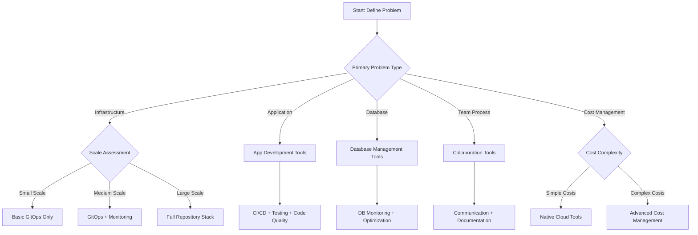

# Solution Fit Analysis: When This Repository ISN'T the Right Answer

## Executive Summary

> **🚨 Critical Self-Assessment**: This repository solves specific infrastructure problems. **It is NOT a universal solution**. This document helps you honestly assess when this approach is wrong and what alternatives might be better.

**Core Principle**: **Better to say "this isn't right" than to force-fit a solution** that creates more problems than it solves.

## 🚨 When This Repository is Definitely NOT the Right Solution

### Clear Disqualification Criteria

If ANY of these apply, **STOP** and consider alternatives:

#### ❌ **Scale Mismatch**
- **Team Size**: 1-2 people with simple workloads
- **Infrastructure**: < 5 services, single cloud provider
- **Deployment Frequency**: Monthly or less frequent
- **Complexity**: Basic CRUD apps, simple microservices

#### ❌ **Problem Type Mismatch**
- **Primary Issue**: Application code quality, not infrastructure
- **Main Challenge**: Database performance, not deployment
- **Core Need**: Feature development, not operations
- **Key Constraint**: Budget for headcount, not tools

#### ❌ **Organizational Readiness Gap**
- **GitOps Maturity**: No version control discipline
- **Cloud Experience**: Team primarily on-premises
- **DevOps Culture**: Manual operations preferred
- **Change Management**: Rigid, slow approval processes

#### ❌ **Technical Constraints**
- **Compliance**: Air-gapped environments, no external connectivity
- **Legacy Systems**: Mainframe, AS/400, other non-cloud-native
- **Network**: Strict egress controls, limited API access
- **Security**: Government classified, no third-party tools allowed

## 🔄 Adjacent Problem Analysis

### Problem Adjacency Matrix

| Your Actual Problem | This Repository's Fit | Better Alternative | Why Alternative is Better |
|-------------------|-------------------|------------------|----------------------|
| **Application Performance** | ❌ Poor fit | APM tools (New Relic, DataDog) | Infrastructure won't fix slow code |
| **Database Optimization** | ❌ Poor fit | Database tuning tools | Network/deployment won't fix queries |
| **Feature Development Speed** | ❌ Poor fit | Better CI/CD, frameworks | Infrastructure isn't bottleneck |
| **Team Collaboration** | ❌ Poor fit | Communication tools, documentation | GitOps won't fix team dynamics |
| **Code Quality** | ❌ Poor fit | Testing frameworks, linters | Deployment automation won't fix bugs |
| **Cost Management (Small Scale)** | ⚠️ Overkill | Manual cost review, alerts | Complex tools for simple problems |
| **Security Compliance** | ⚠️ Partial fit | Security scanners, policy tools | GitOps is deployment, not security |
| **Monitoring Gaps** | ⚠️ Partial fit | Monitoring platforms | GitOps won't create visibility |

## 🎯 Honest Self-Assessment Framework

### Step 1: Problem Classification

```markdown
# Problem Classification Exercise

## Category 1: Infrastructure vs. Application
- [ ] My problems are primarily about deploying and managing infrastructure
- [ ] My problems are primarily about application performance/quality
- [ ] My problems are mixed between infrastructure and application

## Category 2: Scale and Complexity
- [ ] Small scale: < 10 services, < 5 engineers
- [ ] Medium scale: 10-50 services, 5-20 engineers  
- [ ] Large scale: 50+ services, 20+ engineers

## Category 3: Change Velocity
- [ ] Low change: Monthly or less frequent deployments
- [ ] Medium change: Weekly deployments
- [ ] High change: Daily or multiple daily deployments

## Category 4: Organizational Maturity
- [ ] Manual operations: No current automation
- [ ] Basic automation: Some scripts, minimal tooling
- [ ] Mature automation: Established DevOps practices
- [ ] Advanced automation: Looking for optimization
```

### Step 2: Solution Fit Scoring

```markdown
# Solution Fit Scorecard

Rate each factor 1-5 (1 = poor fit, 5 = excellent fit)

## Problem Alignment
- [ ] Infrastructure focus: ___/5
- [ ] Scale appropriateness: ___/5
- [ ] Change velocity match: ___/5
- [ ] Organizational readiness: ___/5

## Implementation Feasibility  
- [ ] Team skills match: ___/5
- [ ] Time availability: ___/5
- [ ] Budget alignment: ___/5
- [ ] Risk tolerance: ___/5

## Total Score: ___/40

### Interpretation:
- **30-40**: Good fit, proceed with confidence
- **20-29**: Partial fit, consider selective adoption
- **10-19**: Poor fit, strongly consider alternatives
- **0-9**: Wrong solution, stop and reassess
```

## 🛣️ Alternative Solution Recommendations

### When Your Real Problem is Application Development

**Symptoms**:
- Slow feature delivery
- Poor code quality
- Application bugs
- Performance issues in code

**Better Solutions**:
```yaml
application_development_stack:
  cicd: "GitHub Actions, GitLab CI, Jenkins"
  testing: "Jest, PyTest, JUnit, Cypress"
  monitoring: "New Relic, DataDog, AppDynamics"
  code_quality: "SonarQube, ESLint, Black"
  collaboration: "Slack, Teams, Confluence"
  project_management: "Jira, Asana, Linear"
```

### When Your Real Problem is Database Management

**Symptoms**:
- Slow queries
- Database performance issues
- Data consistency problems
- Backup/recovery challenges

**Better Solutions**:
```yaml
database_management_stack:
  monitoring: "Prometheus + Grafana with DB exporters"
  optimization: "Index analysis, query tuning tools"
  backup: "Database-native backup tools"
  security: "Database activity monitoring"
  performance: "APM tools with database focus"
```

### When Your Real Problem is Team Process

**Symptoms**:
- Poor communication
- Inconsistent workflows
- Knowledge sharing gaps
- Coordination challenges

**Better Solutions**:
```yaml
team_process_stack:
  communication: "Slack, Teams, Discord"
  documentation: "Confluence, Notion, GitBook"
  project_tracking: "Jira, Asana, Monday.com"
  knowledge_sharing: "Internal wikis, lunch-and-learns"
  workflow_automation: "Zapier, Make.com, custom scripts"
```

### When Your Real Problem is Basic Cloud Cost Management

**Symptoms**:
- High cloud bills
- Resource waste
- Lack of cost visibility
- Simple optimization needs

**Better Solutions**:
```yaml
cost_management_simple:
  monitoring: "Cloud provider native tools"
  alerting: "Cost alerts, budget notifications"
  optimization: "Rightsizing guides, scheduling"
  reporting: "Monthly cost reviews"
  automation: "Simple scripts for cleanup"
```

## 🔄 Hybrid Approaches: Partial Adoption

### When Some Components Fit, Others Don't

#### Scenario 1: Infrastructure Focus, Application Problems
```yaml
hybrid_approach_1:
  adopt_from_repo:
    - flux_core                    # For basic GitOps
    - basic_monitoring             # For visibility
    - deployment_automation        # For consistency
  
  supplement_with:
    - application_monitoring        # For app performance
    - code_quality_tools          # For development quality
    - team_collaboration         # For communication
```

#### Scenario 2: Small Scale, Growing Complexity
```yaml
hybrid_approach_2:
  adopt_from_repo:
    - flux_core                    # Foundation
    - simple_monitoring            # Basic visibility
  
  defer_from_repo:
    - ai_agents                  # Too complex for current scale
    - consensus_layer             # Overkill for simple needs
    - multi_cloud_controllers     # Single cloud sufficient
  
  future_consideration:
    - add_ai_agents_when_team_grows
    - add_consensus_when_multi_cloud
    - add_temporal_when_workflows_complexify
```

#### Scenario 3: Compliance-Heavy Environment
```yaml
hybrid_approach_3:
  adopt_from_repo:
    - flux_core                    # For audit trail
    - basic_monitoring            # For compliance reporting
    - deployment_automation        # For consistency
  
  supplement_with:
    - compliance_scanning         # For policy checking
    - audit_logging              # For regulatory needs
    - security_monitoring         # For threat detection
    - change_management          # For approval workflows
```

## 📊 Decision Tree: Alternative Paths



## 🎯 Exit Criteria: When to Abandon This Approach

### Red Flags That Signal "Wrong Solution"

1. **Implementation Struggle**: Team cannot understand or implement after 2 weeks
2. **Value Gap**: After 1 month, no measurable improvement
3. **Complexity Overhead**: More time managing tools than solving problems
4. **Team Resistance**: >50% of team actively opposes the approach
5. **Cost Explosion**: Tool costs exceed problem costs

### Graceful Exit Strategy

```markdown
# Exit Plan Template

## Immediate Actions (Week 1)
- [ ] Pause implementation immediately
- [ ] Conduct honest team retrospective
- [ ] Document what worked and what didn't
- [ ] Calculate sunk costs vs. potential value

## Assessment (Week 2)
- [ ] Re-evaluate original problem definition
- [ ] Research alternative solutions
- [ ] Get external perspective (consultant, peer review)
- [ ] Make go/no-go decision

## Transition (Week 3-4)
- [ ] If continuing: Simplify approach dramatically
- [ ] If stopping: Plan orderly transition to alternative
- [ ] Document lessons learned
- [ ] Communicate decision to stakeholders
```

## 🔄 Problem Evolution: Adapting to Changing Needs

### When Problems Evolve Beyond Original Scope

#### Scenario A: Growth Creates New Complexity
```yaml
evolution_response_growth:
  original_solution: "basic_flux_monitoring"
  new_problem: "multi_cloud_coordination"
  
  adaptation_path:
    month_0_3: "add_multi_cloud_controllers"
    month_3_6: "add_temporal_workflows"
    month_6_9: "add_ai_optimization"
    month_9_12: "add_consensus_layer"
```

#### Scenario B: Market Forces New Requirements
```yaml
evolution_response_market:
  original_solution: "single_cloud_gitops"
  new_problem: "vendor_diversification"
  
  adaptation_path:
    immediate: "add_second_cloud_support"
    short_term: "implement_cost_optimization"
    long_term: "add_cross_cloud_automation"
```

#### Scenario C: Regulatory Changes
```yaml
evolution_response_regulatory:
  original_solution: "basic_deployment_automation"
  new_problem: "compliance_reporting"
  
  adaptation_path:
    immediate: "add_audit_logging"
    short_term: "implement_compliance_scanning"
    long_term: "add_automated_reporting"
```

## 📚 Alternative Solution Resources

### When This Repository Isn't Right, Consider:

#### For Simple Infrastructure Needs
- **Terraform Cloud**: Simple, managed Terraform
- **Pulumi**: Infrastructure as code with programming languages
- **Cloud Provider Tools**: AWS CDK, Azure Bicep, GCP Deployment Manager
- **Simple GitOps**: Basic Argo CD, simple Flux setups

#### For Application Development
- **GitHub Actions**: Integrated CI/CD
- **GitLab CI/CD**: All-in-one DevOps platform
- **Vercel/Netlify**: Simple application deployment
- **Heroku/Railway**: Platform-as-a-Service

#### For Monitoring and Observability
- **DataDog**: Comprehensive monitoring
- **New Relic**: APM and infrastructure monitoring
- **Prometheus/Grafana**: Open-source monitoring stack
- **CloudWatch/Monitor**: Cloud provider native tools

#### For Cost Management
- **Cloudability**: Third-party cost optimization
- **ParkMyCloud**: Automated resource management
- **Native Tools**: AWS Cost Explorer, Azure Cost Management
- **Custom Scripts**: Simple automation for specific needs

## 🎯 Final Accountability Check

### Before Implementing Any Solution, Ask:

1. **Have I honestly defined my problem?**
   - [ ] Yes, specific and measurable
   - [ ] No, need more clarity

2. **Is this solution proportional to my problem?**
   - [ ] Yes, appropriate complexity
   - [ ] No, overkill for my needs

3. **Do I have the capability to implement this?**
   - [ ] Yes, team skills and time available
   - [ ] No, need different approach

4. **What's my exit plan if this doesn't work?**
   - [ ] Yes, clear alternative identified
   - [ ] No, need contingency planning

5. **Am I doing this for the right reasons?**
   - [ ] Yes, solving real business problems
   - [ ] No, technology for technology's sake

---

**Document Version**: 1.0  
**Last Updated**: 2025-03-12  
**Purpose**: Honest assessment of solution fit and alternatives  
**Review Cycle**: Before any implementation decision  
**Accountability**: Required for self-assessment honesty
