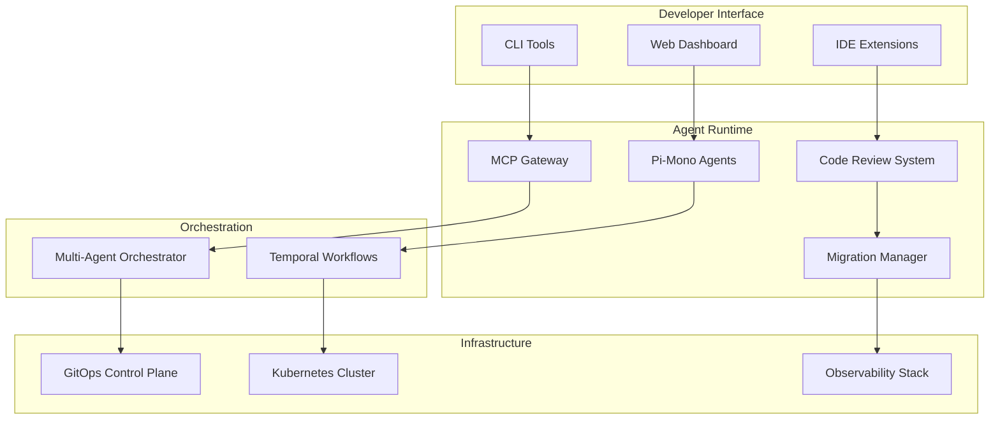
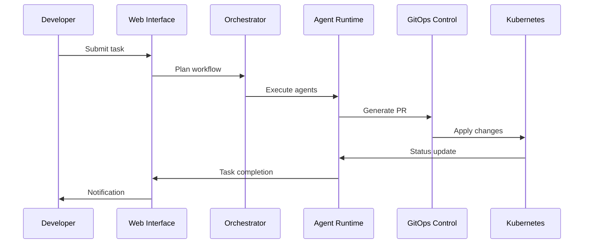

# Uber Agentic Platform Insights and Implementation Plan

This document analyzes key insights from Uber's agentic AI platform and provides a comprehensive implementation plan for enhancing the Agentic Reconciliation Engine with proven patterns from Uber's production experience.

## Executive Summary

Uber's journey from pair programming to peer programming reveals critical patterns for scaling AI agents in infrastructure automation. Their experience shows that 70% of initial agent workloads focus on toil tasks, with significant ROI from autonomous background agents, centralized MCP management, and intelligent code review automation.

## Key Insights from Uber's Agentic Platform

### 1. MCP Gateway Architecture

**Uber's Pattern**: Central MCP gateway with authorization, telemetry, logging, and sandbox discovery
- Proxy external and internal MCPs consistently
- Registry for server discovery and management
- Developer sandbox for experimentation
- Unified authorization and telemetry

**Current State**: Basic MCP server startup scripts
**Gap**: No centralized management or observability

### 2. Background Agent Platform ("Minion")

**Uber's Pattern**: Autonomous background agents running in CI with:
- Full repository access and network connectivity
- Web interface for task management
- Slack integration for notifications
- GitHub PR co-authoring
- Template-based prompt management
- Agent log observability

**Current State**: Pi-Mono containerized agent exists
**Gap**: Limited async capabilities and web interface

### 3. Multi-Agent Workflow Model

**Uber's Pattern**: Shift from interactive to async multi-agent execution
- Developers run multiple agents simultaneously
- Cost-aware model routing (planning vs execution)
- Template management for consistent prompts
- Background processing with notifications

**Current State**: Temporal orchestration documented
**Gap**: Limited practical implementation patterns

### 4. Code Review Automation ("UReview")

**Uber's Pattern**: Intelligent code review pipeline with:
- Pre-processing for code analysis
- Plugin architecture for comment generation
- Quality grading to reduce noise
- External bot API integration
- Duplicate comment detection
- Risk-based prioritization

**Current State**: Basic GitOps validation
**Gap**: No intelligent code review automation

### 5. Migration Management ("Shephard")

**Uber's Pattern**: Campaign management system for large-scale changes:
- YAML-defined migration workflows
- PR generation and tracking
- Smart notification system
- Integration with code review tools
- Refresh and rebase automation

**Current State**: Manual GitOps workflows
**Gap**: No campaign management capabilities

### 6. Observability and Cost Management

**Uber's Pattern**: Comprehensive monitoring with:
- Token usage tracking per agent/skill
- Cost attribution by team/project
- Performance metrics and SLA tracking
- Alerting for anomalous behavior
- 6x cost increase necessitated optimization

**Current State**: Basic monitoring mentioned
**Gap**: Limited cost and performance observability

### 7. Developer Experience Enhancements

**Uber's Pattern**: Tools to improve developer productivity:
- Unified agent task inbox ("Code Inbox")
- Smart assignment algorithms
- Risk-based review prioritization
- Focus time protection
- Slack integration with batching

**Current State**: CLI and dashboard mentioned
**Gap**: Limited developer experience optimization

## Implementation Plan

### Phase 1: Foundation Infrastructure (Months 1-2)

#### 1.1 MCP Gateway Implementation

**Location**: `core/ai/runtime/mcp-gateway/`

**Components**:
```yaml
mcp-gateway/
├── gateway/           # Go service for MCP proxy
│   ├── main.go
│   ├── proxy.go       # MCP request routing
│   ├── auth.go        # Authorization middleware
│   └── telemetry.go   # Usage tracking
├── registry/         # MCP server discovery
│   ├── server.go      # Registration API
│   ├── discovery.go   # Server lookup
│   └── health.go      # Health monitoring
├── auth/            # Authorization & telemetry
│   ├── middleware.go # JWT/OAuth integration
│   ├── rbac.go       # Role-based access
│   └── audit.go      # Access logging
└── sandbox/         # Development testing
    ├── dev-server.go # Development registry
    ├── test-client.go # MCP testing tools
    └── mock-servers/  # Test MCP implementations
```

**Key Features**:
- Centralized MCP server proxy with authentication
- Service discovery and health monitoring
- Usage telemetry and cost tracking
- Development sandbox for experimentation
- Integration with existing authentication systems

#### 1.2 Enhanced Pi-Mono Agent Platform

**Location**: `core/ai/runtime/pi-mono-agent/`

**Enhancements**:
```yaml
pi-mono-agent/
├── async/           # Background task management
│   ├── scheduler.go  # Task scheduling
│   ├── queue.go      # Task queue management
│   └── worker.go     # Background workers
├── web-ui/          # Web interface
│   ├── dashboard/    # React dashboard
│   ├── api/          # REST API
│   └── static/       # Static assets
├── notifications/   # Alert system
│   ├── slack.go      # Slack integration
│   ├── email.go      # Email notifications
│   └── webhook.go    # Webhook support
└── observability/   # Monitoring
    ├── metrics.go    # Prometheus metrics
    ├── logging.go    # Structured logging
    └── tracing.go    # Distributed tracing
```

**Key Features**:
- Async task execution with web interface
- Multi-channel notifications (Slack, email, webhook)
- Comprehensive observability and monitoring
- Template-based prompt management
- Agent log debugging and replay

### Phase 2: Intelligent Automation (Months 3-4)

#### 2.1 Code Review Automation System

**Location**: `core/ai/runtime/code-review/`

**Components**:
```yaml
code-review/
├── preprocessor/     # Code analysis pipeline
│   ├── analyzer.go   # Code structure analysis
│   ├── diff.go       # Change detection
│   └── context.go    # Repository context
├── plugins/         # Comment generation rules
│   ├── security.go   # Security vulnerability detection
│   ├── performance.go # Performance issue identification
│   ├── style.go      # Code style validation
│   └── best-practices.go # Industry standard checks
├── grader/          # Quality assessment
│   ├── confidence.go # Comment confidence scoring
│   ├── impact.go     # Change impact analysis
│   └── noise.go      # Noise reduction filtering
└── integrations/    # External bot APIs
    ├── github.go     # GitHub API integration
    ├── gitlab.go     # GitLab API integration
    └── external.go   # Third-party bot integration
```

**Key Features**:
- Intelligent code analysis and change detection
- Plugin-based comment generation system
- Quality grading to reduce noise and improve relevance
- Integration with external code review tools
- Risk-based prioritization of review comments

#### 2.2 Migration Management System

**Location**: `core/ai/runtime/migration-manager/`

**Components**:
```yaml
migration-manager/
├── campaigns/       # Campaign management
│   ├── manager.go    # Campaign orchestration
│   ├── tracker.go    # Progress tracking
│   └── scheduler.go  # Execution scheduling
├── workflows/       # YAML-defined workflows
│   ├── parser.go     # Workflow parsing
│   ├── validator.go  # Workflow validation
│   └── executor.go   # Workflow execution
├── generators/      # PR generation
│   ├── github.go     # GitHub PR creation
│   ├── gitlab.go     # GitLab merge request creation
│   └── templates.go  # PR template management
└── notifications/   # Smart notifications
    ├── assigner.go   # Smart reviewer assignment
    ├── notifier.go   # Notification delivery
    └── escaler.go    # Escalation management
```

**Key Features**:
- YAML-defined migration workflows
- Automated PR generation and tracking
- Smart reviewer assignment based on expertise
- Integration with existing code review systems
- Campaign progress monitoring and reporting

### Phase 3: Advanced Features (Months 5-6)

#### 3.1 Multi-Agent Orchestration

**Location**: `core/ai/runtime/orchestrator/`

**Components**:
```yaml
orchestrator/
├── scheduler/       # Agent scheduling
│   ├── planner.go    # Task planning
│   ├── router.go     # Agent selection
│   └── optimizer.go  # Cost optimization
├── coordination/    # Multi-agent coordination
│   ├── manager.go    # Agent lifecycle
│   ├── communicator.go # Inter-agent communication
│   └── synchronizer.go # Task synchronization
├── templates/       # Template management
│   ├── loader.go     # Template loading
│   ├── validator.go  # Template validation
│   └── renderer.go   # Template rendering
└── cost-optimizer/  # Cost management
    ├── tracker.go    # Cost tracking
    ├── optimizer.go  # Cost optimization
    └── reporter.go   # Cost reporting
```

**Key Features**:
- Intelligent agent selection based on task requirements
- Cost-aware model routing (planning vs execution)
- Template management for consistent prompts
- Multi-agent coordination and synchronization
- Real-time cost optimization and tracking

#### 3.2 Advanced Observability

**Location**: `core/ai/runtime/observability/`

**Components**:
```yaml
observability/
├── metrics/         # Metrics collection
│   ├── agent.go      # Agent performance metrics
│   ├── cost.go       # Cost tracking metrics
│   └── quality.go    # Quality metrics
├── logging/         # Enhanced logging
│   ├── structured.go # Structured logging
│   ├── correlation.go # Request correlation
│   └── aggregation.go # Log aggregation
├── tracing/         # Distributed tracing
│   ├── jaeger.go     # Jaeger integration
│   ├── span.go       # Span management
│   └── propagation.go # Trace propagation
└── alerting/        # Alert management
    ├── rules.go      # Alert rules
    ├── notifier.go   # Alert delivery
    └── escalation.go # Escalation policies
```

**Key Features**:
- Comprehensive metrics collection and analysis
- Distributed tracing for request flow visualization
- Intelligent alerting with escalation policies
- Cost attribution and optimization recommendations
- Performance SLA monitoring and reporting

### Phase 4: Developer Experience (Months 7-8)

#### 4.1 Unified Developer Dashboard

**Location**: `core/ai/runtime/dev-dashboard/`

**Components**:
```yaml
dev-dashboard/
├── inbox/           # Task management
│   ├── manager.go    # Task inbox management
│   ├── prioritizer.go # Task prioritization
│   └── assigner.go   # Smart assignment
├── workflows/       # Workflow management
│   ├── designer.go   # Workflow designer
│   ├── executor.go   # Workflow execution
│   └── monitor.go    # Workflow monitoring
├── analytics/       # Analytics and reporting
│   ├── productivity.go # Productivity metrics
│   ├── usage.go      # Usage analytics
│   └── insights.go   # Actionable insights
└── settings/        # Personalization
    ├── preferences.go # User preferences
    ├── notifications.go # Notification settings
    └── integrations.go # External integrations
```

**Key Features**:
- Unified task inbox with smart prioritization
- Workflow designer for custom automation
- Productivity analytics and insights
- Personalized notification management
- Integration with existing developer tools

## Technical Architecture

### System Integration



### Data Flow



## Implementation Considerations

### Resource Requirements

**Team Composition**:
- 2-3 Go developers (MCP gateway, orchestration)
- 2-3 Frontend developers (web interfaces, dashboards)
- 2 DevOps engineers (deployment, monitoring)
- 1-2 ML engineers (agent optimization, prompt engineering)

**Infrastructure**:
- Kubernetes cluster (3+ nodes for agent workloads)
- Redis/Cassandra for task queuing and state
- Prometheus + Grafana for monitoring
- Jaeger for distributed tracing
- PostgreSQL for metadata storage

### Security Considerations

**Authentication & Authorization**:
- OAuth2/OIDC integration with existing identity providers
- Role-based access control (RBAC) for agent operations
- API key management for external integrations
- Audit logging for all agent operations

**Data Protection**:
- Encryption at rest and in transit
- Sensitive data redaction in logs
- Compliance with GDPR, SOC2, etc.
- Regular security assessments

### Performance Considerations

**Scalability**:
- Horizontal scaling of agent workloads
- Load balancing for MCP gateway
- Caching for frequently accessed data
- Rate limiting for external API calls

**Reliability**:
- Circuit breaker patterns for external dependencies
- Graceful degradation when services are unavailable
- Retry mechanisms with exponential backoff
- Health checks and auto-healing

### Cost Management

**Optimization Strategies**:
- Model selection based on task complexity
- Token usage optimization and caching
- Resource scheduling and rightsizing
- Cost attribution and budget management

**Monitoring**:
- Real-time cost tracking per agent/skill
- Budget alerts and spending limits
- Cost optimization recommendations
- ROI analysis and reporting

## Success Metrics

### Technical Metrics

- **Agent Success Rate**: >95% successful task completion
- **Response Time**: <5 minutes for toil tasks
- **Cost Efficiency**: 50% reduction in manual effort
- **System Availability**: >99.9% uptime

### Business Metrics

- **Developer Productivity**: 2-3x increase in throughput
- **Time to Market**: 50% reduction in deployment time
- **Quality Improvement**: 40% reduction in bugs
- **Cost Savings**: 30% reduction in operational costs

### Adoption Metrics

- **Agent Usage**: 70% of developers using agents regularly
- **Task Automation**: 80% of toil tasks automated
- **User Satisfaction**: >4.5/5 developer satisfaction score
- **Knowledge Sharing**: 60% increase in cross-team collaboration

## Risk Mitigation

### Technical Risks

**Agent Reliability**:
- Comprehensive testing and validation
- Fallback mechanisms for critical operations
- Gradual rollout with feature flags
- Continuous monitoring and improvement

**Integration Complexity**:
- Modular architecture with clear interfaces
- Comprehensive API documentation
- Integration testing with all components
- Backward compatibility considerations

### Business Risks

**Adoption Resistance**:
- Developer training and onboarding
- Quick wins to demonstrate value
- Champions program for early adopters
- Regular feedback collection and iteration

**Cost Overruns**:
- Budget tracking and alerts
- Cost optimization automation
- Regular cost reviews and adjustments
- ROI measurement and reporting

## Conclusion

Uber's experience provides a proven roadmap for implementing agentic AI platforms in infrastructure automation. By following their patterns and adapting them to the GitOps control plane context, we can achieve significant improvements in developer productivity, operational efficiency, and system reliability.

The implementation plan outlined above provides a structured approach to building these capabilities over 8 months, with clear phases, milestones, and success metrics. The key is to start with foundational infrastructure (MCP gateway, enhanced agents) and progressively add more sophisticated capabilities (code review automation, migration management, advanced orchestration).

By learning from Uber's experience and avoiding their pitfalls (cost overruns, adoption challenges), we can build a more efficient and effective agentic platform for Agentic Reconciliation Engine management.
